typora-copy-images-to: images
typora-root-url: images

# 第一章 变量和数据类型

## 5.1变量概述

- **变量**：常量是固定不变的数据，那么在程序中可以变化的量称为变量。

>数学中，可以使用字母代替数字运算,例如×=1+5或者6=x+5。
>
>程序中，可以使用字母保存数字的方式进行运算，提高计算能力，可以解决更多的问题。比如x保存5，x也可
>
>以保存6，这样x保存的数据是可以改变的，也就是我们所讲解的变量。

**注意事项：**

> 如果创建多个变量，那么变量之间的名称不可以重复。
>
> 对于float和long类型来说，字母后缀F和L不要丢掉。
>
> 如果使用byte或者short类型的变量，那么右侧的数据值不能超过左侧类型的范围。
>
> 没有进行赋值的变量，不能直接使用;一定要赋值之后，才能使用。
>
> 变量使用不能超过作用域的范围。【作用域】:从定义变量的一行开始，一直到直接所属的大括号结束为止。
>
> 可以通过一个语句来创建多个变量，但是一般情况不推荐这么写。

Java中要求一个变量每次只能保存一个数据，必须要明确保存的数据类型。

## 5.2数据类型

### 数据类型分类

Java数据分为两大类：

- **基本数据类型**：**`整数`、`浮点数`、`字符`、`布尔`**
- **引用数据类型**：**`类`、`数组`、`接口`、`String`**

### 基本数据类型

四类八种数据类型：

|   数据类型   | 关键字       | 内存占用 | 取值范围                         |
| :----------: | ------------ | -------- | -------------------------------- |
|    字节型    | byte         | 1个字节  | -128~127                         |
|    短整型    | short        | 2个字节  | -32768~32767                     |
|     整型     | int(默认)    | 4个字节  | -2³¹~2³¹-1                       |
|    长整型    | long         | 8个字节  | -2<sup>63</sup>~2<sup>63</sup>-1 |
| 单精度浮点数 | float        | 4个字节  | 1.4013E-45~3.4028E+38            |
| 双精度浮点数 | double(默认) | 8个字节  | 4.9E-324~1.7977E+308             |
|    字符型    | char         | 2个字节  | 0~65535                          |
|   布尔类型   | boolean      | 1个字节  | true,false                       |

**注意事项:**

> 字符串不是基本类型，而是引用类型
>
> 浮点型可能是一个近似值，而非精确值
>
> 数据范围与字节数不一定相关，例如float数据范围比long更广泛
>
> 浮点数默认类型是double，如果一定要用float类型，需要加上一个后缀F
>
> 整数默认是int，long类型需要加上后缀L

## 5.3数据类型转换

当数据类型不一样时，将会发生数据类型转换

**自动转换：**

- **特点**：代码不需要进行特殊处理，自动完成。
- **规则**：数据范围从小到大。

**强制类型转换：**

- **特点**：代码需要进行特殊的格式处理，不能自动完成。

- **格式**：范围小的类型范围小的变量名=(范围小的类型)原本范围大的数据

  ```java
  int num = (int)100L;
  ```

- **注意事项：**

  > 1、强制类型转换一般不推荐使用，因为有可能发生精度损失、数据溢出。
  >
  > 2、强制转换要避免超出范围
  >
  > 3、**byte**/**short**/**char**这三种类型都可以发生数学运算，例如加法“+”.计算机底层会用二进制数来代表字符
  >
  > 4、**byte/short/char**这三种类型在运算的时候，都会被首先提升成为**int**类型，然后再计算
  >
  > ```java
  > byte num1 = 50;
  > byte num2 = 40;
  > //由于byte/short/char在做运算时会提升为int类型，所以用byte/ short/char类型变量接收会报错，因为两个byte变量运算完后是一个int类型，不会自动向下转换
  > //byte res = num1 + num2;
  > int res = num1 + num2;
  > System.out.println(res);
  > 
  > // 65没有超过char的范围，编译器会自动将65转换为char类型，对应的是A字符
  > char ch = 65;
  > System.out.println(ch);//A
  > ```
  >
  > 5、**编译器的常量优化**：在给变量进行赋值的时候，如果右侧的表达式当中全都是常量，没有任何变量,那么**编译器javac**将会直接将若干个常量表达式计算得到结果。但如果表达式中有变量参与，就不会进行这种优化
  >
  > ```JAVA
  > short result = 5 + 8;
  > //等号右边全都是常量，没有任何变量参与运算编译之后，得到的.class字节码文件当中相当于【直接就是】:short result = 13;
  > ```

# 第二章 方法

## 5.1注意事项

- 方法应该定义在类当中，但是不能在方法当中再定义方法。不能嵌套。
- 方法定义的前后顺序无所谓。
- 方法定义之后不会执行，如果希望执行，一定要调用:单独调用、打印调用、赋值调用。
- 如果方法有返回值，那么必须写上“return 返回值;”，不能没有。
- return后面的返回值数据，必须和方法的返回值类型，对应起来。
- 对于一个void没有返回值的方法，不能写return后面的返回值，只能写return;（用来结束方法）。
- 对于void方法当中最后一行的return可以省略不写。
- 一个方法当中可以有多个return语句，但是必须保证同时只有一个会被执行到。

## 5.2重载

**重载(Overloading)**：如果有两个方法的方法名相同，但参数不一致，哪么可以说一个方法是另一个方法的重载。

**方法重载与下列因素相关：**

>方法名相同
>
>方法的参数类型，参数个不一样
>
>方法的返回类型可以不相同
>
>方法的修饰符可以不相同
>
>main 方法也可以被重载

**方法重载与下列因素无关：**

>与参数名无关
>
>与方法的返回值类型无关
>
>与修饰符无关

```java
public static void main(String[] args) {
        System.out.println(sum(10, 20));
    	System.out.println(sum(10,20,30));
    }

private static int sum(int a, int b) {
        return a + b;
}

private static int sum(int a, int b, int c) {
        return a + b + c;
}
```

# 第三章 数组

**数组**：是一种容器，可以同时存放多个数据值。

**特点：**

>数组是一种引用数据类型
>
>数组当中的多个数据，类型必须统一
>
>数组的长度在程序运行期间不可改变

## 3.1常见初始化方法

1. 动态初始化(指定长度)：

   ```java
   //数据类型 [] 数组名称 = new 数据类型[数组长度];
   int [] arr = new int[3];
   
   ```

2. 静态初始化(指定内容)：

   ```java
   //数据类型 [] 数组名称 = new 数据类型[] {元素1,元素2,...};
   int [] arr = new int[]{1,2,3}
   //省略格式
   int [] arr = {元素1,元素2,...};
   ```

   **注意事项：**

   >虽然静态初始化没有直接告诉长度，但是根据大括号里面的元素具体内容，也可以自动推算出来长度。
   >
   >静态初始化、动态初始化标准格式可以拆分成为两个步骤。
   >
   >```java
   >int [] arr;
   >arr = new int[]{1,2,3};
   >```
   >
   >静态初始化一旦使用省略格式，就不能拆分成为两个步骤了。

**使用建议**：如果不确定数组当中的具体内容，用动态初始化；否则，已经确定了具体的内容，用静态初始化。

## 3.2如何访问数组元素

如果直接打印数组，得到的是数组对应的内存地址的哈希值(16进制)。

**访问**数组元素的格式：**数组名称[索引值]**，索引值从0开始，最大为数组的长度-1

**注意事项：**

> 使用动态初始化数组的时候，其中的元素将会自动拥有一个默认值。规则如下:
>
> 如果是整数类型,那么默认为**0**;
>
> 如果是浮点类型,那么默认为**0.0**；
>
> 如果是字符类型,那么默认为**'\u0000'**;
>
> 如果是布尔类型，那么默认为**false**

## 3.3常见问题

**数组索引越界异常(java.lang.ArrayIndexOutOfBoundsException)**：数组的索引值从**0**开始，最大为**数组的长度-1**，当索引值不在该范围内时，发生数组越界异常

```java
int[] arr = {1,2,3};
System.out.println(arr[3]);
```

**空指针异常(java.lang.NullpointerException）**：所有的引用类型变量，都可以赋值为一个null值。但是代表其中什么都没有。所以在没有给数组赋值时，就使用该数组会发生空指针异常。

```java
int[] arr = null;
System.out.println(arr[0]);
```

## 3.4数组的遍历

```java
int[] arr = {10,20,30,40,50};
//普通的方式
for(int i = 0;i<arr.length;i++){
    System.out.println(arr[i])
}
//增强for循环的方式
// for(数据类型 变量:数组名称)
for(int i : arr){
    System.out.println(i)
}
```


# 第四章 Java的内存分配

Java的内存需要划分成5个部分：栈、堆、方法区

## 4.1栈

**栈(stack)**：存放的都是方法中的局部变量

**局部变量**：方法的参数，或是方法内部的变量

**作用域**：一旦超出作用域，立刻从栈内存中消失

## 4.2堆

**堆(Heap)**：反是new出来的东西，都在堆内存中。

堆内存里面的东西都有一个地址值(16进制)

堆内存中的数据都有默认值。规则：

> 如果是整数类型，默认为**0**
>
> 如果是浮点类型，默认为**0.0**
>
> 如果是字符类型，默认为**'\u0000'**
>
> 如果是布尔类型，默认为**false**
>
> 如果是信用类型，默认为**null**

## 4.3方法区

**方法区(Method Area)**：存储**.class**相关信息，包含方法的信息

## 4.4本地方法栈

**本地方法栈(Native Method Stack)**：与操作系统相关

## 4.5寄存器

**寄存器(pc Register)**：与CPU相关

## 示例

- **只有一个数组**：main方法进入**方法区**，要执行main方法，就必须要让main方法**进栈**，然后给main方法**分配**一块内存空间，`int[] array`定义了一个数组变量放入**栈内存**，`new int[3]`则放入**堆内存**并且分配一个地址值，再将这个地址值赋值给**array**变量。`array[1]`根据名称找到栈内存中的**array**变量，在根据array地址值以及索引找到堆内存中对应的地址。


- **有两个独立的数组**：

  

- **两个引用指向同一个数组的内存图**：`int[] arrayB = arrayA;`是将arrayA的地址赋值给arrayB，所以都指向同一个地址地址


- **数组的长度在运行期间是不可变的：**所以下列改变数组的长度，其实是创建了一个新的数组


# 第五章 面向对象

## 5.1概念

**面向过程**：当需要实现一个功能的时候，每一个具体的步骤都要亲力亲为，详细处理每一个细节。**强调步骤**。

**面向对象**：当需要实现一个功能的时候，不关心具体的步骤，而是找一个已经具有该功能的人，来帮我做事儿。**强调对象**。

## 5.2特点

**面向对象思想**是一种更符合我们思考习惯的思想，它可以将复杂的事情简单化，并将我们从执行者变成了指挥者。

面向对象的语言中，包含了三大**基本特征**，即**封装**、**继承**和**多态**。

## 5.3类和对象

### 什么是类

- **类**：是一组相关**属性**和**行为**的集合。可以看成是一类事物的模板，使用事物的属性特征和行为特征来描述该 类事物。
- **属性**：就是该事物的状态信息。 
- **行为**：就是该事物能够做什么。

### 什么是对象

- **对象**：是一类事物的具体体现。对象是类的一个实例，必然具备该类事物的属性和行为。

### 类与对象的关系

- **类**是对一类事物的描述，是**抽象的**。 
- **对象**是一类事物的实例，是**具体的**。 
- **类是对象的模板，对象是类的实体**。

## 5.4类的定义

### 事物与类的对比 

现实世界的一类事物： 

**属性**：事物的状态信息。 **行为**：事物能够做什么。 

Java中用class描述事物也是如此： 

**成员变量**：对应事物的**属性**。 **成员方法**：对应事物的**行为**

### 类的定义格式

```java
public class Student {
    //成员变量
	String name；//姓名
	int age；//年龄//成员方法
	//学习的方法
	publicvoid study() {
		System.out.println("好好学习，天天向上");
	}
	//吃饭的方法
	publicvoid eat() {
		System.out.println("学习饿了要吃饭");
	}
}
```

- **定义类**：就是定义类的成员，包括成员变量和成员方法。
- **成员变量**：和以前定义变量几乎是一样的。只不过位置发生了改变。在类中，方法外。
- **成员方法**：和以前定义方法几乎是一样的。只不过把**static**去掉,加上static的是**类方法**

## 5.5对象的使用

创建对象：

```java
类名 对象名 = new 类名();
```

使用对象访问类中的成员：

```java
对象名.成员变量；
对象名.成员方法()；
```

对象的使用格式举例：

```java
public class Test01_Student {
    public static void main(String[] args) {
    //创建对象格式：类名 对象名 = new 类名();
    Student s = new Student();
    System.out.println("s:"+s); //cn.itcast.Student@100363
    //直接输出成员变量值
    System.out.println("姓名："+s.name); //null
    System.out.println("年龄："+s.age); //0
    System.out.println("‐‐‐‐‐‐‐‐‐‐");
    //给成员变量赋值
    s.name = "赵丽颖";
    s.age = 18;
    //再次输出成员变量的值
    System.out.println("姓名："+s.name); //赵丽颖
    System.out.println("年龄："+s.age); //18
    System.out.println("‐‐‐‐‐‐‐‐‐‐");
    //调用成员方法
    s.study(); // "好好学习，天天向上"
    s.eat(); // "学习饿了要吃饭"
	}
}
```

### 成员变量的默认值

|          | 数据类型                       |          |
| -------- | ------------------------------ | -------- |
| 基本类型 | 整数（byte，short，int，long） | 0        |
|          | 浮点数（float，double）        | 0.0      |
|          | 字符（char）                   | '\u0000' |
|          | 布尔（boolean）                | false    |
| 引用类型 | 数组，类，接口                 | null     |

### 5.6对象的内存图

### 一个对象调用一个方法的内存图


>方法区存放了两个class文件，一个是Phone.class一个Demo01PhoneOne.class，程序要运行，main方法先进栈开始执行main方法，`Phone one`创建一个变量存在栈内存中，`new phone()`创建了一个Phone对象，由栈内存中的one变量存储，new出来的Phone对象有什么内容在方法区中存放，拥有成员变量brand、price、color（有默认值）和成员方法call、sendMessage，注意的是成员方法保存的是一个地址值指向的就是方法去张红成员方法的内存地址。而成员变量的值就存在堆中，然后再给这个new出来的对象分配地址值，栈中的one变量存放指向该对象的地址值。例`one.brand`通过one找到堆中对应的对象地址，再找到对应的brand变量。而`one.sendMessage();`是先通过one找到堆中的对象，在找到对象中的成员方法存放的地址，在找到方法区中所对应的成员方法。`one.call("乔布斯")`运行先进栈，运行完会立刻出栈(弹栈)，sendMessage同样。最后main方法执行完毕,main方法出栈，程序结束。

### 两个对象使用同一个方法的内存图


> 与一个对象调用一个方法类似，由于two变量是重新new了一个对象，所以也是第二个对象的成员变量和成员方法都是新的

### 两个引用指向同一个对象的内存图


>  与两个对象使用同一个方法不同，由于只是将one变量存放的地址值赋值给了two变量，所以并没有新创建一个对象，而是one和two都指向了同一个对象，即当one和two共享同一个变量，即two变量的成员变量并不是初始给的默认值，而是之前通过one变量修改过的值。

### 使用对象类型作为方法的参数


> 与前几个不同的是，method方法通过main方法中的`method(one);`将method方法调入栈中，并将one变量的存放的地址值给力形参one

### 使用对象类型作为方法的返回值


> 与之前不同的是，getPhone具有返回值，getPhone方法返回的one对象的地址值赋值给two对象，再根据two的地址值寻找brand属性

## 5.6成员变量和局部变量的区别

**定义的位置**：

- 局部变量：在方法内部
- 成员变量：在方法外部，直接写在类中

**作用范围**：

- 局部变量：只有方法中才可以使用，出了方法就不能再用了
- 成员变量：整个类全部可以使用

**默认值**：

- 局部变量:没有默认值，如果要想使用,必须手动进行赋值
- 成员变量：如果没有赋值，会有默认值，规则和数组一样

**内存的位置**：

- 局部变量：是属于方法的，所以在栈内存
- 成员变量：是new一个对象里的成员变量，所以在堆内存中

**生命周期**：

# 第六章 封装

## 6.1封装性

**概念**：封装就是将一些细节信息隐藏起来，对于外界不可见。

封装在Java中的**体现**：

- 方法就是一种封装
- 关键字private也是一种封装（属性是private，使用get和set方法间接对其操作）

## 6.2封装的步骤——private关键字

### private的含义

- private是一个权限修饰符，代表最小权限。 
- 可以修饰成员变量和成员方法。 
- 被private修饰后的成员变量和成员方法，只在本类中才能访问。

### private的使用格式

```java
private 数据类型 变量名；
```

1. 使用`private`修饰成员变量：

   ```java
   public class Student { 
       private String name; 
       private int age; 
   }
   ```

2. 提供`getXxx`方法 `setXxx`方法，可以访问成员变量：

   ```java
   public class Student { 
       private String name; 
       private int age; 
       
       public void setName(String n) { 
           name = n; 
       }
       
       public String getName() { 
           return name; 
       }
       
       public void setAge(int a) { 
           age = a; 
       }
       
       public int getAge() {
           return age; 
       } 
   }
   ```

## 6.3封装优化1——this关键字

我们发现 `setXxx`方法中的形参名字并不符合见名知意的规定，那么如果修改与成员变量名一致，是否就见名知意 了呢？代码如下： 

```java
public class Student { 
    private String name; 
    private int age; 
    
    public void setName(String name) { 
        name = name; 
    }
    
    public void setAge(int age) { 
        age = age; 
    } 
}
```

经过修改和测试，我们发现新的问题，成员变量赋值失败了。也就是说，在修改了`setXxx()`的形参变量名后，方 法并没有给成员变量赋值！这是由于形参变量名与成员变量名重名，导致成员变量名被隐藏，方法中的变量名，无 法访问到成员变量，从而赋值失败。所以，我们只能使用this关键字，来解决这个重名问题。 

### this的含义

当方法的局部变量和类的成员变量重名的时候，根据“就近原则”，优先使用局部变量。如果需要访问本类当中的成员变量,需要使用格式（this）。

this代表所在类的当前对象的引用（地址值），即对象自己的引用。 

> 记住 ：方法被哪个对象调用，方法中的this就代表那个对象。即谁在调用，this就代表谁。 

### this使用格式

```java
this.成员变量名；
```

使用 `this`修饰方法中的变量，解决成员变量被隐藏的问题，代码如下： 

```java
public class Student { 
    private String name; 
    private int age; 
    
    public void setName(String name) { 
        //name = name; 
        this.name = name; 
    }
    
    public String getName() { 
        return name; 
    }
    
    public void setAge(int age) { 
        //age = age; 
        this.age = age; 
    }
    
    public int getAge() { 
        return age;
    } 
}
```

> 小贴士：方法中只有一个变量名时，默认也是使用 this 修饰，可以省略不写。

## 6.4封装优化2——构造方法

当一个对象被创建时候，构造方法用来初始化该对象，给对象的成员变量赋初始值。 

> 小贴士：无论你与否自定义构造方法，所有的类都有构造方法，因为Java自动提供了一个无参数构造方法， 一旦自己定义了构造方法，Java自动提供的默认无参数构造方法就会失效。 

### 构造方法的定义格式

```java
修饰符 构造方法名(参数列表){ 
    // 方法体 
}
```

构造方法的写法上，方法名与它所在的类名相同。它没有返回值，所以不需要返回值类型，甚至不需要void。使用 

构造方法后，代码如下： 

```java
public class Student { 
    private String name; 
    private int age; 
    // 无参数构造方法 
    public Student() {} 
    // 有参数构造方法
    public Student(String name,int age) { 
    this.name = name; 
    this.age = age; 
	} 
}
```

### 注意事项

- 如果你不提供构造方法，系统会给出无参数构造方法。 
- 如果你提供了构造方法，系统将不再提供无参数构造方法。 
- 构造方法是可以重载的，既可以定义参数，也可以不定义参数。 

## 6.5标准代码——JavaBean

`JavaBean`是Java语言编写类的一种标准规范。符合`JavaBean`的类，要求类必须是具体的和公共的，并且具有无参数的构造方法，提供用来操作成员变量的`set`和`get`方法。

```java
public class ClassName{ 
    //成员变量 
    //构造方法 
    //无参构造方法【必须】 
    //有参构造方法【建议】 
    //成员方法 
    //getXxx() 
    //setXxx() 
}
```

 编写符合`JavaBean`规范的类，以学生类为例，标准代码如下： 

```java
public class Student { 
    //成员变量 
    private String name; 
    private int age; 
    //构造方法 
    public Student() {} 
    public Student(String name,int age) { 
        this.name = name; 
        this.age = age; 
    }
    //成员方法 
    publicvoid setName(String name) { 
        this.name = name; 
    }
    
    public String getName() { 
        return name; 
    }
    public void setAge(int age) { 
        this.age = age; 
    }
    
    public int getAge() { 
        return age; 
    } 
}
```

测试类，代码如下： 

```java
public class TestStudent { 
    public static void main(String[] args) { 
        //无参构造使用 
        Student s= new Student(); 
        s.setName("柳岩"); 
        s.setAge(18); 
        System.out.println(s.getName()+"‐‐‐"+s.getAge());
        //带参构造使用 
        Student s2= new Student("赵丽颖",18);
        System.out.println(s.getName()+"‐‐‐"+s.getAge());
	} 
}
```

# 第七章 常用API

## 7.1API概述

API(Application Programming Interface)，应用程序编程接口。Java API是一本程序员的 字典 ，是JDK中提供给我们使用的类的说明文档。这些类将底层的代码实现封装了起来，我们不需要关心这些类是如何实现的，只需要学习这些类如何使用即可。所以我们可以通过查询API的方式，来学习Java提供的类，并得知如何使用它们。

### API使用步骤

1. 打开帮助文档。 
2. 点击显示，找到索引，看到输入框。 
3. 你要找谁？在输入框里输入，然后回车。 
4. 看包。java.lang下的类不需要导包，其他需要。 
5. 看类的解释和说明。 
6. 学习构造方法。
7. 使用成员方法。 

## 7.2Scanner类

Scanner类：个可以解析基本类型和字符串的简单文本扫描器。 例如，以下代码使用户能够从 System.in 中读取一个数：

```java
Scanner sc = new Scanner(System.in); 
int i = sc.nextInt();
```

> 备注：System.in 系统输入指的是通过键盘录入数据。

### 引用类型使用步骤

#### 导包

使用import关键字导包，在类的所有代码之前导包，引入要使用的类型，java.lang包下的所有类无需导入。 格 

式：

```java
import 包名.类名;
```

举例：

```java
import java.util.Scanner;
```

#### 创建对象

使用该类的构造方法，创建一个该类的对象。 格式：

```java
数据类型 变量名 = new 数据类型(参数列表);
```

举例：

```java
Scanner sc = new Scanner(System.in);
```

#### 调用方法

调用该类的成员方法，完成指定功能。 格式： 

```java
变量名.方法名();
```

举例：

```java
int i = sc.nextInt(); // 接收一个键盘录入的整数
```

### Scanner类的使用步骤

```java
//1. 导包 
import java.util.Scanner; 
public class Demo01_Scanner { 
    public static void main(String[] args) { 
        //2. 创建键盘录入数据的对象 
        Scanner sc = new Scanner(System.in); 
        //3. 接收数据 
        System.out.println("请录入一个整数："); 
        int i = sc.nextInt(); 
        //4. 输出数据 
        System.out.println("i:"+i); 
    } 
}
```

## 7.3匿名对象

### 概念

概念：创建对象时，只有创建对象的语句，却没有把对象地址值赋值给某个变量。虽然是创建对象的简化写法，但是应用 场景非常有限。 

- **匿名对象**：没有变量名的对象。 

格式：

```java
new 类名(参数列表);
```

举例：

```java
new Scanner(System.in)；
```

### 应用场景

1. 创建匿名对象直接调用方法，没有变量名。 

   ```java
   new Scanner(System.in).nextInt();
   ```

2.  一旦调用两次方法，就是创建了两个对象，造成浪费，请看如下代码：

   ```java
   new Scanner(System.in).nextInt(); 
   new Scanner(System.in).nextInt();
   ```

3. 匿名对象可以作为方法的参数和返回值 :

   - 作为参数：

     ```java
     class Test { 
         public static void main(String[] args) { 
             // 普通方式 
             Scanner sc = new Scanner(System.in); 
             input(sc); 
             //匿名对象作为方法接收的参数 
             input(new Scanner(System.in)); 
     	}
         public static void input(Scanner sc){ 
             System.out.println(sc); 
         } 
     }
     ```

   - 作为返回值：

     ```java
     class Test2 { 
         public static void main(String[] args) { 
             // 普通方式 
             Scanner sc = getScanner(); 
         }
         
         public static Scanner getScanner(){ 
             //普通方式 
             //Scanner sc = new Scanner(System.in); 
             //return sc; 
             
             //匿名对象作为方法返回值 
             return new Scanner(System.in); 
         } 
     }
     ```

## 7.4Random类

### 概念

此类的实例用于生成伪随机数。 例如，以下代码使用户能够得到一个随机数：

```java
Random r = new Random(); 
int i = r.nextInt();
```

### Random类使用步骤

```java
//1. 导包 
import java.util.Random; 

public class Demo01_Random { 
    public static void main(String[] args) { 
        //2. 创建键盘录入数据的对象 
        Random r = new Random(); 
        for(int i = 0; i < 3; i++){ 
            //3. 随机生成一个数据 [0,10) 
            int number = r.nextInt(10); 
            //4. 输出数据 
            System.out.println("number:"+ number); 
        } 
    } 
}
```

>备注：创建一个`Random`对象，每次调用nextInt() 方法，都会生成一个随机数。 

## 7.5ArrayList

### 引入——静态数组

使用学生数组，存储三个学生对象，代码如下： 

```java
public class Student { 
    private String name; 
    
    private int age; 
    
    public Student() { }
    
    public Student(String name, int age) { 
        this.name = name; 
        this.age = age; 
    }
    
    public String getName() { 
        return name; 
    }
    
    public void setName(String name) { 
        this.name = name; 
    }
    public int getAge() { 
        return age; 
    }
    
    public void setAge(int age) { 
        this.age = age; 
    } 
}

public class Test01StudentArray { 
    public static void main(String[] args) { 
        //创建学生数组 
        Student[] students = new Student[3]; 
        //创建学生对象 
        Student s1 = new Student("曹操",40); 
        Student s2 = new Student("刘备",35); 
        Student s3 = new Student("孙权",30); 
        //把学生对象作为元素赋值给学生数组 
        students[0] = s1; students[1] = s2; students[2] = s3; 
        //遍历学生数组 
        for(int x=0; x<students.length; x++) { 
            Student s = students[x]; 
            System.out.println(s.getName()+"‐‐‐"+s.getAge()); 
        } 
    } 
}
```

到目前为止，我们想存储对象数据，选择的容器，只有对象数组。而数组的长度是固定的，无法适应数据变化的需 求。为了解决这个问题，Java提供了另一个容器 java.util.ArrayList 集合类,让我们可以更便捷的存储和操作对 象数据

### 什么是ArrayList类

`java.util.ArrayList` 是大小**可变的数组**的实现，存储在内的数据称为元素。此类提供一些方法来操作内部存储 的元素。 `ArrayList`中可不断添加元素，其大小也自动增长。

### ArrayList使用步骤

- `java.util.ArrayList <E>` ：该类需要 import导入使后使用。 

`<E>` ，表示一种指定的数据类型，叫做泛型。`E`，取自Element（元素）的首字母。在出现E的地方，我们使用一种引用数据类型将其替换即可，表示我们将存储哪种引用类型的元素。代码如下： 

```java
ArrayList<String>，ArrayList<Student>
```

**基本格式**(在JDK 7后,右侧泛型的尖括号之内可以留空，但是<>仍然要写。简化格式： )：

```java
ArrayList<String> list = new ArrayList<String>();
//省略写法
ArrayList<String> list = new ArrayList<>();
```

### 常用方法

对于元素的操作,基本体现在——增、删、查。常用的方法有： 

- `public boolean add(E e)` ：将指定的元素添加到此集合的尾部。 
- `public E remove(int index)` ：移除此集合中指定位置上的元素。返回被删除的元素。 
- `public E get(int index)` ：返回此集合中指定位置上的元素。返回获取的元素。 
- `public int size()` ：返回此集合中的元素数。遍历集合时，可以控制索引范围，防止越界。

```java
public class Demo01ArrayListMethod { 
    public static void main(String[] args) { 
        //创建集合对象 
        ArrayList<String> list = new ArrayList<String>(); 
        //添加元素 
        list.add("hello"); 
        list.add("world"); 
        list.add("java"); 
        //public E get(int index):返回指定索引处的元素 
        System.out.println("get:"+list.get(0)); 
        System.out.println("get:"+list.get(1)); 
        System.out.println("get:"+list.get(2)); 
        //public int size():返回集合中的元素的个数 
        System.out.println("size:"+list.size()); 
        //public E remove(int index):删除指定索引处的元素，返回被删除的元素 
        System.out.println("remove:"+list.remove(0)); 
        //遍历输出 
        for(int i = 0; i < list.size(); i++){ 
            System.out.println(list.get(i)); 
        } 
    } 
}
```

### 如何存储基本数据类型

ArrayList对象不能存储基本类型，**只能存储引用类型的数据**。类似`<int>`不能写，但是存储基本数据类型对应的 包装类型是可以的。所以，想要存储基本类型数据， `<>` 中的数据类型，必须转换后才能编写，转换写法如下： 

```java
//利用基本数据类型的封装类,即可正常使用,基本类型和封装类在使用上没有太大区别
ArrayList<Integer> list = new ArrayList<>();
```

# 第八章 String类、static关键字、Arrays类，Math类

## 8.1String类

**概述**：`java.lang.String` 类代表字符串。Java程序中所有的字符串文字（例如 `"abc"` ）都可以被看作是实现此类的实 例。

类`String`中包括用于检查各个字符串的方法，比如用于**比较**字符串，**搜索**字符串，**提取**子字符串以及创建具有翻 译为**大写**或**小写**的所有字符的字符串的副本。 

**特点**

1. 字符串不变：字符串的值在创建后不能被更改。

```java
String s1 = "abc"; 
s1 += "d"; System.out.println(s1); // "abcd" 
// 内存中有"abc"，"abcd"两个对象，s1从指向"abc"，改变指向，指向了"abcd"。
```

2. 因为String对象是不可变的，所以它们可以被共享。

```java
String s1 = "abc"; 
String s2 = "abc"; 
// 内存中只有一个"abc"对象被创建，同时被s1和s2共享。
```

3. `"abc"` 等效于 `char[] data={ 'a' , 'b' , 'c' }` 。

```java
例如： 
    String str = "abc"; 
相当于： 
    char data[] = {'a', 'b', 'c'}; 
	String str = new String(data); 
// String底层是靠字符数组实现的。
```

### 获取功能方法

- `public int length ()` ：返回此字符串的长度。 
- `public String concat (String str)` ：将指定的字符串连接到该字符串的末尾。 
- `public char charAt (int index)` ：返回指定索引处的 char值。 
- `public int indexOf (String str)` ：返回指定子字符串第一次出现在该字符串内的索引。 
- `public String substring (int beginIndex)` ：返回一个子字符串，从beginIndex开始截取字符串到字符 串结尾。 
- `public String substring (int beginIndex, int endIndex)` ：返回一个子字符串，从beginIndex到 endIndex截取字符串。含beginIndex，不含endIndex。

```java
public class String_Demo02 { 
    public static void main(String[] args) { 
        //创建字符串对象 
        String s = "helloworld"; 
        // int length():获取字符串的长度，其实也就是字符个数 
        System.out.println(s.length()); 
        System.out.println("‐‐‐‐‐‐‐‐"); 
        // String concat (String str):将将指定的字符串连接到该字符串的末尾. 
        String s = "helloworld"; 
        String s2 = s.concat("**hello itheima");
        System.out.println(s2);// helloworld**hello itheima 
        // char charAt(int index):获取指定索引处的字符 
        System.out.println(s.charAt(0)); 
        System.out.println(s.charAt(1)); 
        System.out.println("‐‐‐‐‐‐‐‐"); 
        // int indexOf(String str):获取str在字符串对象中第一次出现的索引,没有返回‐1
        System.out.println(s.indexOf("l")); 
        System.out.println(s.indexOf("owo")); 
        System.out.println(s.indexOf("ak")); 
        System.out.println("‐‐‐‐‐‐‐‐"); 
        // String substring(int start):从start开始截取字符串到字符串结尾 
        System.out.println(s.substring(0)); 
        System.out.println(s.substring(5)); 
        System.out.println("‐‐‐‐‐‐‐‐"); 
        // String substring(int start,int end):从start到end截取字符串。含start，不含end。 
        System.out.println(s.substring(0, s.length())); 
        System.out.println(s.substring(3,8)); 
    } 
}
```

### 转换功能方法

- `public char[] toCharArray ()` ：将此字符串转换为新的字符数组。 
- `public byte[] getBytes ()` ：使用平台的默认字符集将该 String编码转换为新的字节数组。 
- `public String replace (CharSequence target, CharSequence replacement)` ：将与target匹配的字符串使用replacement字符串替换。

```java
public class String_Demo03 { 
    public static void main(String[] args) { 
        //创建字符串对象 
        String s = "abcde"; 
        // char[] toCharArray():把字符串转换为字符数组 
        char[] chs = s.toCharArray(); 
        for(int x = 0; x < chs.length; x++) { 
            System.out.println(chs[x]); 
        }
        System.out.println("‐‐‐‐‐‐‐‐‐‐‐"); 
        // byte[] getBytes ():把字符串转换为字节数组 
        byte[] bytes = s.getBytes(); 
        for(int x = 0; x < bytes.length; x++) { 
            System.out.println(bytes[x]); 
        }
        System.out.println("‐‐‐‐‐‐‐‐‐‐‐"); 
        // 替换字母it为大写IT
        String str = "itcast itheima"; 
        String replace = str.replace("it", "IT"); 
        System.out.println(replace); // ITcast ITheima 
        System.out.println("‐‐‐‐‐‐‐‐‐‐‐"); 
    } 
}
```


### 分割功能方法

- `public String[] split(String regex)` ：将此字符串按照给定的regex(规则）拆分为字符串数组。 

  ```java
  public class String_Demo03 { 
      public static void main(String[] args) { 
          //创建字符串对象 
          String s = "aa|bb|cc"; 
          String[] strArray = s.split("|"); // ["aa","bb","cc"] 
          for(int x = 0; x < strArray.length; x++) {
              System.out.println(strArray[x]); // aa bb cc 
          } 
      } 
  }
  ```

## 8.2static关键字

**概述**：关于`static`关键字的使用，它可以用来修饰的成员变量和成员方法，被修饰的成员是**属于类**的，而不是单单是属 于某个对象的。也就是说，既然属于类，就可以不靠创建对象来调用了。 

### 类变量

当`static`修饰成员变量时，该变量称为**类变量**。该类的每个对象都**共享**同一个类变量的值。任何对象都可以更改 该类变量的值，但也可以在不创建该类的对象的情况下对类变量进行操作。 

```java
static int num；
```

### 静态方法

当`static`修饰成员方法时，该方法称为**类方法** 。静态方法在声明中有static，建议使用类名来调用，而不需要创建类的对象。调用方式非常简单。 

```java
public static void showNum() { 
    System.out.println("num:" + num);                              
}
```

- 注意事项：

  > 静态方法可以直接访问类变量和静态方法。 
  >
  > 静态方法**不能直接访问**普通成员变量或成员方法。反之，成员方法可以直接访问类变量或静态方法。 
  >
  > 静态方法中，不能使用**this**关键字。
  >
  > 小贴士：静态方法只能访问静态成员。

### 如何调用

被static修饰的成员可以并且建议通过**类名直接访问**。虽然也可以通过对象名访问静态成员，原因即多个对象均属 于一个类，共享使用同一个静态成员，但是不建议，会出现警告信息。 即使用对象调用，javac编译器编译时还是会翻译成`类名.方法`

```java
public class StuDemo2 { 
    public static void main(String[] args) { 
        // 访问类变量 
        System.out.println(Student.num); 
        // 调用静态方法 
        Student.showNum(); 
    } 
}
```

### 静态原理图解

`static`修饰的内容： 

- 是随着类的加载而加载的，且只加载一次。
-  存储于一块固定的内存区域（静态区），所以，可以直接被类名调用。 
- 它优先于对象存在，所以，可以被所有对象共享。 

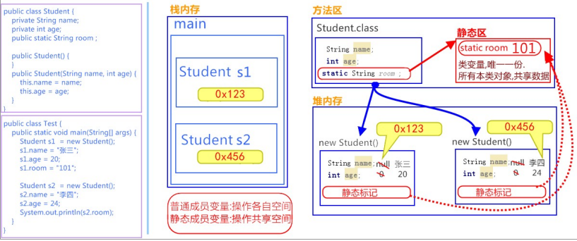

> 方法区保存了Student.class的相关信息，方法区中还存在一个静态区用来存放静态数据，所以`room`静态变量就会存进静态区中，当创建了两个Student对象时，其他的成员变量在对象创建时，存放在了堆内存中，而静态成员变量`room`则指向了静态区

### 静态代码块

- **静态代码块**：定义在成员位置，使用static修饰的代码块{ }。 

  - 位置：类中方法外。 

  - 执行：随着类的加载而执行且执行一次，优先于main方法和构造方法的执行。 格式：

    ```java
    public class ClassName{ 
    	static { // 执行语句 
        } 
    }
    ```

**作用**：给类变量进行初始化赋值。用法演示，代码如下：

```java
public class Game { 
    public static int number; 
    public static ArrayList<String> list; 
    static { 
        // 给类变量赋值 
        number = 2; 
        list = new ArrayList<String>(); 
        // 添加元素到集合中 
        list.add("张三"); 
        list.add("李四"); 
    } 
}
```

> **小贴士**： 
>
> `static`关键字，可以修饰变量、方法和代码块。在使用的过程中，其主要目的还是想在不创建对象的情况 下，去调用方法。下面将介绍两个工具类，来体现static方法的便利。 

## 8.3Arrays类

**概述**：`java.util.Arrays`此类包含用来操作数组的各种方法，比如排序和搜索等。其所有方法均为静态方法，调用起来 非常简单。 

### 操作数组的方法

- `public static String toString(int[] a)` ：返回指定数组内容的字符串表示形式

```java
public static void main(String[] args) { 
    // 定义int 数组 
    int[] arr = {2,34,35,4,657,8,69,9}; 
    // 打印数组,输出地址值 
    System.out.println(arr); // [I@2ac1fdc4 
    // 数组内容转为字符串 
    String s = Arrays.toString(arr); 
    // 打印字符串,输出内容 
    System.out.println(s); // [2, 34, 35, 4, 657, 8, 69, 9] 
}
```

- `public static void sort(int[] a)` ：对指定的int型数组按数字升序进行排序，也可对其他类型数组进行排序。 

```java
public static void main(String[] args) { 
    // 定义int 数组 
    int[] arr = {24, 7, 5, 48, 4, 46, 35, 11, 6, 2}; 
    System.out.println("排序前:"+ Arrays.toString(arr));
    // 排序前:[24, 7, 5, 48, 4, 46, 35, 11, 6, 2]
    // 升序排序 
    Arrays.sort(arr); System.out.println("排序后:"+ Arrays.toString(arr));
    // 排序后:[2, 4, 5, 6, 7, 11, 24, 35, 46, 48] 
}
```

## 8.4Math类

**概述**：`java.lang.Math`类包含用于执行基本数学运算的方法，如初等指数、对数、平方根和三角函数。类似这样的工具 类，其所有方法均为静态方法，并且不会创建对象，调用起来非常简单。 

- public static double abs(double a) ：返回 double 值的绝对值

```java
double d1 = Math.abs(‐5); //d1的值为5 
double d2 = Math.abs(5); //d2的值为5
```

- public static double ceil(double a) ：返回大于等于参数的最小的整数。 

```java
double d1 = Math.ceil(3.3); //d1的值为 4.0 
double d2 = Math.ceil(‐3.3); //d2的值为 ‐3.0 
double d3 = Math.ceil(5.1); //d3的值为 6.0
```

- public static double floor(double a) ：返回小于等于参数最大的整数。 

```java
double d1 = Math.floor(3.3); //d1的值为3.0 
double d2 = Math.floor(‐3.3); //d2的值为‐4.0 
double d3 = Math.floor(5.1); //d3的值为 5.0
```

- public static long round(double a) ：返回最接近参数的 long。(相当于四舍五入方法) 

```java
long d1 = Math.round(5.5); //d1的值为6.0 
long d2 = Math.round(5.4); //d2的值为5.0
```

# 第九章 继承

## 9.1定义

**继承**：就是子类继承父类的**属性**和**行为**，使得子类对象具有与父类相同的属性、相同的行为。子类可以直接 访问父类中的**非私有**的属性和行为。 

## 9.2优点

- 提高**代码的复用性**。 
- 类与类之间产生了关系，是**多态的前提**。

## 9.3特点

- Java只支持单继承，不支持多继承。 
- Java支持多层继承(继承体系)。
- 顶层父类是Object类。所有的类默认继承Object，作为父类。 
- 子类和父类是一种相对的概念。 


## 9.4继承后的成员变量

当子父类中出现了同名的成员变量时，在子类中需要访问父类中非私有成员变量时，需要使用`super`关键字，修饰 父类成员变量，类似于之前学过的`this`。 

```java
super.父类成员变量名
```

> 小贴士：Fu 类中的成员变量是非私有的，子类中可以直接访问。若Fu 类中的成员变量私有了，子类是不能直接访问的。通常编码时，我们遵循封装的原则，使用private修饰成员变量，那么如何访问父类的私有成员变量呢？对！可以在父类中提供公共的getXxx方法和setXxx方法。

## 9.5继承后的成员方法

对象调用方法时，会先在子类中查找有没有对 应的方法，若子类中存在就会执行子类中的方法，若子类中不存在就会执行父类中相应的方法。

### 重写(override)

如果子类父类中出现**重名**的成员方法，这时的访问是一种特殊情况，叫做**方法重写** (Override)。 

- **方法重写** ：子类中出现与父类一模一样的方法时（返回值类型，方法名和参数列表都相同），会出现覆盖效 果，也称为重写或者复写。**声明不变，重新实现**。

#### 重写的应用

子类可以根据需要，定义特定于自己的行为。既沿袭了父类的功能名称，又根据子类的需要重新实现父类方法，从 而进行扩展增强。比如新的手机增加来电显示头像的功能，代码如下：

```java
class Phone { 
    public void sendMessage(){ 
        System.out.println("发短信"); 
    }
    
    public void call(){ 
        System.out.println("打电话"); 
    }
    
    public void showNum(){ 
        System.out.println("来电显示号码"); 
    } 
}

//智能手机类 
class NewPhone extends Phone { 
    //重写父类的来电显示号码功能，并增加自己的显示姓名和图片功能 
    public void showNum(){ 
        //调用父类已经存在的功能使用
        super super.showNum(); 
        //增加自己特有显示姓名和图片功能 
        System.out.println("显示来电姓名"); 
        System.out.println("显示头像"); 
    } 
}

public class ExtendsDemo06 { 
    public static void main(String[] args) { 
        // 创建子类对象 
        NewPhone np = new NewPhone();
        // 调用父类继承而来的方法 
        np.call(); 
        // 调用子类重写的方法 
        np.showNum(); 
    } 
}
```

> 小贴士：这里重写时，用到super.父类成员方法，表示调用父类的成员方法。 
>
> 注意事项：
>
> - 子类方法覆盖父类方法，必须要保证权限大于等于父类权限。 
> - 子类方法覆盖父类方法，返回值类型、函数名和参数列表都要一模一样。 

## 9.6继承后的构造方法

### 父类空间优先于子类对象产生

在每次创建子类对象时，先初始化父类空间，再创建其子类对象本身。目的在于子类对象中包含了其对应的父类空 间，便可以包含其父类的成员，如果父类成员非private修饰，则子类可以随意使用父类成员。代码体现在子类构造方法调用时，一定先调用父类的构造方法。理解图解如下： 


> 在Zi.class信息中，存在[[super_class]]标记用来指向父类。
>
> 在堆内存中，子类对象一定包含了一个完成的父类结构。

### super和this的含义

- **super** ：代表父类的**存储空间标识**(可以理解为父亲的引用)。
- **this** ：代表**当前对象的引用**(谁调用就代表谁)。

### super和this的用法

```java
this.成员变量 ‐‐ 本类的 
super.成员变量 ‐‐ 父类的 
this.成员方法名() ‐‐ 本类的 
super.成员方法名() ‐‐ 父类的
this(...) ‐‐ 本类的构造方法 
super(...) ‐‐ 父类的构造方法
```

> 子类的每个构造方法中均有默认的super()，调用父类的无参构造，即隐含存在的。
>
> 手动调用父类构造会覆盖默认的super()。
>
> super() 和 this() 都必须是在构造方法的**第一行**，所以不能同时出现。 
>
> **注意事项**：
>
> - 在实际情况中，如果添加了有参构造方法都会在写上无参构造方法，避免程序出现错误(因为子类默认都会调用父类的无参构造方法，如果父类只有写了有参构造发方法，java不会再提供无参构造方法，此时子类对象在创建时，没有父类的无参构造方法可以调用，导致报错)

# Collection、泛型

## 主要内容

- Collection集合
- 迭代器
- 增强for
- 泛型

## 教学目标

- 能够说出集合与数组的区别
- 说出Collection集合的常用功能
- 能够使用迭代器对集合进行取元素
- 能够说出集合的使用细节
- 能够使用集合存储自定义类型
- 能够使用forEach循环遍历集合
- 能够使用泛型定义集合对象
- 能够理解泛型上下限
- 能够阐述泛型通配符的作用

## 第一章 Collection集合

### 1.1 集合概述

在前面基础班我们已经学习过并使用过集合ArrayList<E> ,那么集合到底是什么呢?

* **集合**：集合是java中提供的一种容器，可以用来存储多个数据。

集合和数组既然都是容器，它们有啥区别呢？

* 数组的长度是固定的。集合的长度是可变的。
* 数组中存储的是同一类型的元素，可以存储基本数据类型值。集合存储的都是对象。而且对象的类型可以不一致。在开发中一般当对象多的时候，使用集合进行存储。

### 1.2  集合框架

JAVASE提供了满足各种需求的API，在使用这些API前，先了解其继承与接口操作架构，才能了解何时采用哪个类，以及类之间如何彼此合作，从而达到灵活应用。

集合按照其存储结构可以分为两大类，分别是单列集合`java.util.Collection`和双列集合`java.util.Map`，今天我们主要学习`Collection`集合，在day04时讲解`Map`集合。

* **Collection**：单列集合类的根接口，用于存储一系列符合某种规则的元素，它有两个重要的子接口，分别是`java.util.List`和`java.util.Set`。其中，`List`的特点是元素有序、元素可重复。`Set`的特点是元素无序，而且不可重复。`List`接口的主要实现类有`java.util.ArrayList`和`java.util.LinkedList`，`Set`接口的主要实现类有`java.util.HashSet`和`java.util.TreeSet`。

从上面的描述可以看出JDK中提供了丰富的集合类库，为了便于初学者进行系统地学习，接下来通过一张图来描述整个集合类的继承体系。


其中，橙色框里填写的都是接口类型，而蓝色框里填写的都是具体的实现类。这几天将针对图中所列举的集合类进行逐一地讲解。

集合本身是一个工具，它存放在**java.util**包中。在`Collection`接口定义着单列集合框架中最最共性的内容。

1. List集合∶有索引、可以存储重复元素、可以保证存取顺序
   1. **ArrayList**：底层是**数组**的实现，查询快、增删慢
   2. **LinkedList**：底层是**链表**的实现，查询慢、增删快
2. Set集合∶无索引、不可以存储重复元素、存取无序
   1. **HashSet**：底层是**哈希表+(红黑树)**实现的，无索引、不可以存储重复元素、存取**无序**
      **LinkedHashSet**：底层是**哈希表+链表**实现的，无索引、不可以存储重复元素、可以**保证存取顺序（有序）**
      **TreeSet（了解）**：底层是**二叉树**实现。一般用于**排序**

### 1.3 Collection 常用功能

Collection是所有单列集合的父接口，因此在Collection中定义了单列集合(List和Set)通用的一些方法，这些方法可用于操作所有的单列集合。方法如下：

* `public boolean add(E e)`：  把给定的对象添加到当前集合中 。
* `public void clear()` :清空集合中所有的元素。
* `public boolean remove(E e)`: 把给定的对象在当前集合中删除。
* `public boolean contains(E e)`: 判断当前集合中是否包含给定的对象。
* `public boolean isEmpty()`: 判断当前集合是否为空。
* `public int size()`: 返回集合中元素的个数。
* `public Object[] toArray()`: 把集合中的元素，存储到数组中。

方法演示：

~~~java
import java.util.ArrayList;
import java.util.Collection;

public class Demo1Collection {
    public static void main(String[] args) {
		// 创建集合对象 
    	// 使用多态形式
    	Collection<String> coll = new ArrayList<String>();
    	// 使用方法
    	// 添加功能  boolean  add(String s)
    	coll.add("小李广");
    	coll.add("扫地僧");
    	coll.add("石破天");
    	System.out.println(coll);

    	// boolean contains(E e) 判断o是否在集合中存在
    	System.out.println("判断  扫地僧 是否在集合中"+coll.contains("扫地僧"));

    	//boolean remove(E e) 删除在集合中的o元素
    	System.out.println("删除石破天："+coll.remove("石破天"));
    	System.out.println("操作之后集合中元素:"+coll);
    	
    	// size() 集合中有几个元素
		System.out.println("集合中有"+coll.size()+"个元素");

		// Object[] toArray()转换成一个Object数组
    	Object[] objects = coll.toArray();
    	// 遍历数组
    	for (int i = 0; i < objects.length; i++) {
			System.out.println(objects[i]);
		}

		// void  clear() 清空集合
		coll.clear();
		System.out.println("集合中内容为："+coll);
		// boolean  isEmpty()  判断是否为空
		System.out.println(coll.isEmpty());  	
	}
}
~~~

> tips: 有关Collection中的方法可不止上面这些，其他方法可以自行查看API学习。

## 第二章 Iterator迭代器

### 2.1 Iterator接口

在程序开发中，经常需要遍历集合中的所有元素。针对这种需求，JDK专门提供了一个接口`java.util.Iterator`。`Iterator`接口也是Java集合中的一员，但它与`Collection`、`Map`接口有所不同，`Collection`接口与`Map`接口主要用于存储元素，而`Iterator`主要用于迭代访问（即遍历）`Collection`中的元素，因此`Iterator`对象也被称为迭代器。

想要遍历Collection集合，那么就要获取该集合迭代器完成迭代操作，下面介绍一下获取迭代器的方法：

* `public Iterator iterator()`: 获取集合对应的迭代器，用来遍历集合中的元素的。

下面介绍一下迭代的概念：

* **迭代**：即Collection集合元素的通用获取方式。在取元素之前先要判断集合中有没有元素，如果有，就把这个元素取出来，继续在判断，如果还有就再取出出来。一直把集合中的所有元素全部取出。这种取出方式专业术语称为迭代。

Iterator接口的常用方法如下：

* `public E next()`:返回迭代的下一个元素。
* `public boolean hasNext()`:如果仍有元素可以迭代，则返回 true。

接下来我们通过案例学习如何使用Iterator迭代集合中元素：

~~~java
public class IteratorDemo {
  	public static void main(String[] args) {
        // 使用多态方式 创建对象
        Collection<String> coll = new ArrayList<String>();

        // 添加元素到集合
        coll.add("串串星人");
        coll.add("吐槽星人");
        coll.add("汪星人");
        //遍历
        //使用迭代器 遍历   每个集合对象都有自己的迭代器
        Iterator<String> it = coll.iterator();
        //  泛型指的是 迭代出 元素的数据类型
        while(it.hasNext()){ //判断是否有迭代元素
            String s = it.next();//获取迭代出的元素
            System.out.println(s);
        }
  	}
}
~~~

> tips:：在进行集合元素取出时，如果集合中已经没有元素了，还继续使用迭代器的next方法，将会发生java.util.NoSuchElementException没有集合元素的错误。

### 2.2 迭代器的实现原理

我们在之前案例已经完成了Iterator遍历集合的整个过程。当遍历集合时，首先通过调用t集合的iterator()方法获得迭代器对象，然后使用hashNext()方法判断集合中是否存在下一个元素，如果存在，则调用next()方法将元素取出，否则说明已到达了集合末尾，停止遍历元素。

Iterator迭代器对象在遍历集合时，内部采用指针的方式来跟踪集合中的元素，为了让初学者能更好地理解迭代器的工作原理，接下来通过一个图例来演示Iterator对象迭代元素的过程：

.bmp)

在调用Iterator的next方法之前，迭代器的索引位于第一个元素之前，不指向任何元素，当第一次调用迭代器的next方法后，迭代器的索引会向后移动一位，指向第一个元素并将该元素返回，当再次调用next方法时，迭代器的索引会指向第二个元素并将该元素返回，依此类推，直到hasNext方法返回false，表示到达了集合的末尾，终止对元素的遍历。

### 2.3 增强for

增强for循环(也称for each循环)是**JDK1.5**以后出来的一个高级for循环，专门用来遍历数组和集合的。它的内部原理其实是个Iterator迭代器，所以在遍历的过程中，不能对集合中的元素进行增删操作。

格式：

~~~java
for(元素的数据类型  变量 : Collection集合or数组){ 
  	//写操作代码
}
~~~

它用于遍历Collection和数组。通常只进行遍历元素，不要在遍历的过程中对集合元素进行增删操作。

#### 练习1：遍历数组

~~~java
public class NBForDemo1 {
    public static void main(String[] args) {
		int[] arr = {3,5,6,87};
       	//使用增强for遍历数组
		for(int a : arr){//a代表数组中的每个元素
			System.out.println(a);
		}
	}
}
~~~

#### 练习2:遍历集合

~~~java
public class NBFor {
    public static void main(String[] args) {        
    	Collection<String> coll = new ArrayList<String>();
    	coll.add("小河神");
    	coll.add("老河神");
    	coll.add("神婆");
    	//使用增强for遍历
    	for(String s :coll){//接收变量s代表 代表被遍历到的集合元素
    		System.out.println(s);
    	}
	}
}
~~~

> tips: 新for循环必须有被遍历的目标。目标只能是Collection或者是数组。新式for仅仅作为遍历操作出现。

## 第三章 泛型

### 3.1  泛型概述

在前面学习集合时，我们都知道集合中是可以存放任意对象的，只要把对象存储集合后，那么这时他们都会被提升成Object类型。当我们在取出每一个对象，并且进行相应的操作，这时必须采用类型转换。

大家观察下面代码：

~~~java
public class GenericDemo {
	public static void main(String[] args) {
		Collection coll = new ArrayList();
		coll.add("abc");
		coll.add("itcast");
		coll.add(5);//由于集合没有做任何限定，任何类型都可以给其中存放
		Iterator it = coll.iterator();
		while(it.hasNext()){
			//需要打印每个字符串的长度,就要把迭代出来的对象转成String类型
			String str = (String) it.next();
			System.out.println(str.length());
		}
	}
}
~~~

程序在运行时发生了问题**java.lang.ClassCastException**。                                                                                             为什么会发生类型转换异常呢？                                                                                                                                       我们来分析下：由于集合中什么类型的元素都可以存储。导致取出时强转引发运行时 ClassCastException。                                                                                                                                                       怎么来解决这个问题呢？                                                                                                                                                           Collection虽然可以存储各种对象，但实际上通常Collection只存储同一类型对象。例如都是存储字符串对象。因此在JDK5之后，新增了**泛型**(**Generic**)语法，让你在设计API时可以指定类或方法支持泛型，这样我们使用API的时候也变得更为简洁，并得到了编译时期的语法检查。

* **泛型**：可以在类或方法中预支地使用未知的类型。

> tips:一般在创建对象时，将未知的类型确定具体的类型。当没有指定泛型时，默认类型为Object类型。

### 3.2  使用泛型的好处

上一节只是讲解了泛型的引入，那么泛型带来了哪些好处呢？

* 将运行时期的ClassCastException，转移到了编译时期变成了编译失败。
* 避免了类型强转的麻烦。

通过我们如下代码体验一下：

~~~java
public class GenericDemo2 {
	public static void main(String[] args) {
        Collection<String> list = new ArrayList<String>();
        list.add("abc");
        list.add("itcast");
        // list.add(5);//当集合明确类型后，存放类型不一致就会编译报错
        // 集合已经明确具体存放的元素类型，那么在使用迭代器的时候，迭代器也同样会知道具体遍历元素类型
        Iterator<String> it = list.iterator();
        while(it.hasNext()){
            String str = it.next();
            //当使用Iterator<String>控制元素类型后，就不需要强转了。获取到的元素直接就是String类型
            System.out.println(str.length());
        }
	}
}
~~~

> tips:泛型是数据类型的一部分，我们将类名与泛型合并一起看做数据类型。

### 3.3  泛型的定义与使用

我们在集合中会大量使用到泛型，这里来完整地学习泛型知识。

泛型，用来灵活地将数据类型应用到不同的类、方法、接口当中。将数据类型作为参数进行传递。


#### 定义和使用含有泛型的类

定义格式：

~~~
修饰符 class 类名<代表泛型的变量> {  }
~~~

例如，API中的ArrayList集合：

~~~java
class ArrayList<E>{ 
    public boolean add(E e){ }

    public E get(int index){ }
   	....
}
~~~

使用泛型： 即什么时候确定泛型。

**在创建对象的时候确定泛型**

 例如，`ArrayList<String> list = new ArrayList<String>();`

此时，变量E的值就是String类型,那么我们的类型就可以理解为：

~~~java 
class ArrayList<String>{ 
     public boolean add(String e){ }

     public String get(int index){  }
     ...
}
~~~

再例如，`ArrayList<Integer> list = new ArrayList<Integer>();`

此时，变量E的值就是Integer类型,那么我们的类型就可以理解为：

~~~java
class ArrayList<Integer> { 
     public boolean add(Integer e) { }

     public Integer get(int index) {  }
     ...
}
~~~

举例自定义泛型类

~~~java
public class MyGenericClass<MVP> {
	//没有MVP类型，在这里代表 未知的一种数据类型 未来传递什么就是什么类型
	private MVP mvp;
     
    public void setMVP(MVP mvp) {
        this.mvp = mvp;
    }
     
    public MVP getMVP() {
        return mvp;
    }
}
~~~

使用:

~~~java
public class GenericClassDemo {
  	public static void main(String[] args) {		 
         // 创建一个泛型为String的类
         MyGenericClass<String> my = new MyGenericClass<String>();    	
         // 调用setMVP
         my.setMVP("大胡子登登");
         // 调用getMVP
         String mvp = my.getMVP();
         System.out.println(mvp);
         //创建一个泛型为Integer的类
         MyGenericClass<Integer> my2 = new MyGenericClass<Integer>(); 
         my2.setMVP(123);   	  
         Integer mvp2 = my2.getMVP();
    }
}
~~~

####  含有泛型的方法

定义格式：

~~~
修饰符 <代表泛型的变量> 返回值类型 方法名(参数){  }
~~~

例如，

~~~java
public class MyGenericMethod {	  
    public <MVP> void show(MVP mvp) {
    	System.out.println(mvp.getClass());
    }
    
    public <MVP> MVP show2(MVP mvp) {	
    	return mvp;
    }
}
~~~

使用格式：**调用方法时，确定泛型的类型**

~~~java
public class GenericMethodDemo {
    public static void main(String[] args) {
        // 创建对象
        MyGenericMethod mm = new MyGenericMethod();
        // 演示看方法提示
        mm.show("aaa");
        mm.show(123);
        mm.show(12.45);
    }
}
~~~

#### 含有泛型的接口

定义格式：

~~~
修饰符 interface接口名<代表泛型的变量> {  }
~~~

例如，

~~~java
public interface MyGenericInterface<E>{
	public abstract void add(E e);
	
	public abstract E getE();  
}
~~~

使用格式：

**1、定义类时确定泛型的类型**

例如

~~~java
public class MyImp1 implements MyGenericInterface<String> {
	@Override
    public void add(String e) {
        // 省略...
    }

	@Override
	public String getE() {
		return null;
	}
}
~~~

此时，泛型E的值就是String类型。

 **2、始终不确定泛型的类型，直到创建对象时，确定泛型的类型**

 例如

~~~java
public class MyImp2<E> implements MyGenericInterface<E> {
	@Override
	public void add(E e) {
       	 // 省略...
	}

	@Override
	public E getE() {
		return null;
	}
}
~~~

确定泛型：

~~~java
/*
 * 使用
 */
public class GenericInterface {
    public static void main(String[] args) {
        MyImp2<String>  my = new MyImp2<String>();  
        my.add("aa");
    }
}
~~~

### 3.4  泛型通配符

当使用泛型类或者接口时，传递的数据中，泛型类型不确定，可以通过通配符<?>表示。但是一旦使用泛型的通配符后，只能使用Object类中的共性方法，集合中元素自身方法无法使用。

#### 通配符基本使用

泛型的通配符:**不知道使用什么类型来接收的时候,此时可以使用?,?表示未知通配符。**

此时只能接受数据,不能往该集合中存储数据。

举个例子大家理解使用即可：

~~~java
public static void main(String[] args) {
    Collection<Intger> list1 = new ArrayList<Integer>();
    getElement(list1);
    Collection<String> list2 = new ArrayList<String>();
    getElement(list2);
}
public static void getElement(Collection<?> coll){}
//？代表可以接收任意类型
~~~

> tips:泛型不存在继承关系 Collection<Object> list = new ArrayList<String>();这种是错误的。

#### 通配符高级使用----受限泛型

之前设置泛型的时候，实际上是可以任意设置的，只要是类就可以设置。但是在JAVA的泛型中可以指定一个泛型的**上限**和**下限**。

**泛型的上限**：

* **格式**： `类型名称 <? extends 类 > 对象名称`
* **意义**： `只能接收该类型及其子类`

**泛型的下限**：

- **格式**： `类型名称 <? super 类 > 对象名称`
- **意义**： `只能接收该类型及其父类型`

比如：现已知Object类，String 类，Number类，Integer类，其中Number是Integer的父类

~~~java
public static void main(String[] args) {
    Collection<Integer> list1 = new ArrayList<Integer>();
    Collection<String> list2 = new ArrayList<String>();
    Collection<Number> list3 = new ArrayList<Number>();
    Collection<Object> list4 = new ArrayList<Object>();
    
    getElement(list1);
    getElement(list2);//报错
    getElement(list3);
    getElement(list4);//报错
  
    getElement2(list1);//报错
    getElement2(list2);//报错
    getElement2(list3);
    getElement2(list4);
  
}
// 泛型的上限：此时的泛型?，必须是Number类型或者Number类型的子类
public static void getElement1(Collection<? extends Number> coll){}
// 泛型的下限：此时的泛型?，必须是Number类型或者Number类型的父类
public static void getElement2(Collection<? super Number> coll){}
~~~

## 第四章 集合综合案例

### 4.1 案例介绍

按照斗地主的规则，完成洗牌发牌的动作。
具体规则：

使用54张牌打乱顺序,三个玩家参与游戏，三人交替摸牌，每人17张牌，最后三张留作底牌。

### 4.2 案例分析

* 准备牌：

  牌可以设计为一个ArrayList<String>,每个字符串为一张牌。
  每张牌由花色数字两部分组成，我们可以使用花色集合与数字集合嵌套迭代完成每张牌的组装。
  牌由Collections类的shuffle方法进行随机排序。

* 发牌

  将每个人以及底牌设计为ArrayList<String>,将最后3张牌直接存放于底牌，剩余牌通过对3取模依次发牌。


* 看牌

  直接打印每个集合。

### 4.3 代码实现

~~~java
import java.util.ArrayList;
import java.util.Collections;

public class Poker {
    public static void main(String[] args) {
        /*
        * 1: 准备牌操作
        */
        //1.1 创建牌盒 将来存储牌面的 
        ArrayList<String> pokerBox = new ArrayList<String>();
        //1.2 创建花色集合
        ArrayList<String> colors = new ArrayList<String>();

        //1.3 创建数字集合
        ArrayList<String> numbers = new ArrayList<String>();

        //1.4 分别给花色 以及 数字集合添加元素
        colors.add("♥");
        colors.add("♦");
        colors.add("♠");
        colors.add("♣");

        for(int i = 2;i<=10;i++){
            numbers.add(i+"");
        }
        numbers.add("J");
        numbers.add("Q");
        numbers.add("K");
        numbers.add("A");
        //1.5 创造牌  拼接牌操作
        // 拿出每一个花色  然后跟每一个数字 进行结合  存储到牌盒中
        for (String color : colors) {
            //color每一个花色 
            //遍历数字集合
            for(String number : numbers){
                //结合
                String card = color+number;
                //存储到牌盒中
                pokerBox.add(card);
            }
        }
        //1.6大王小王
        pokerBox.add("小☺");
        pokerBox.add("大☠");	  
        // System.out.println(pokerBox);
        //洗牌 是不是就是将  牌盒中 牌的索引打乱 
        // Collections类  工具类  都是 静态方法
        // shuffer方法   
        /*
         * static void shuffle(List<?> list) 
         *     使用默认随机源对指定列表进行置换。 
         */
        //2:洗牌
        Collections.shuffle(pokerBox);
        //3 发牌
        //3.1 创建 三个 玩家集合  创建一个底牌集合
        ArrayList<String> player1 = new ArrayList<String>();
        ArrayList<String> player2 = new ArrayList<String>();
        ArrayList<String> player3 = new ArrayList<String>();
        ArrayList<String> dipai = new ArrayList<String>();	  

        //遍历 牌盒  必须知道索引   
        for(int i = 0;i<pokerBox.size();i++){
            //获取 牌面
            String card = pokerBox.get(i);
            //留出三张底牌 存到 底牌集合中
            if(i>=51){//存到底牌集合中
                dipai.add(card);
            } else {
                //玩家1   %3  ==0
                if(i%3==0){
                  	player1.add(card);
                }else if(i%3==1){//玩家2
                  	player2.add(card);
                }else{//玩家3
                  	player3.add(card);
                }
            }
        }
        //看看
        System.out.println("令狐冲："+player1);
        System.out.println("田伯光："+player2);
        System.out.println("绿竹翁："+player3);
        System.out.println("底牌："+dipai);  
	}
}
~~~


# List、Set、数据结构、Collections

## 主要内容

- 数据结构
- List集合
- Set集合
- Collections

## 教学目标

- 能够说出List集合特点
- 能够说出常见的数据结构
- 能够说出数组结构特点
- 能够说出栈结构特点
- 能够说出队列结构特点
- 能够说出单向链表结构特点
- 能够说出Set集合的特点
- 能够说出哈希表的特点
- 使用HashSet集合存储自定义元素
- 能够说出可变参数的格式
- 能够使用集合工具类
- 能够使用Comparator比较器进行排序

## 第一章 数据结构

### 2.1 数据结构有什么用？

当你用着java里面的容器类很爽的时候，你有没有想过，怎么ArrayList就像一个无限扩充的数组，也好像链表之类的。好用吗？好用，这就是数据结构的用处，只不过你在不知不觉中使用了。

现实世界的存储，我们使用的工具和建模。每种数据结构有自己的优点和缺点，想想如果Google的数据用的是数组的存储，我们还能方便地查询到所需要的数据吗？而算法，在这么多的数据中如何做到最快的插入，查找，删除，也是在追求更快。

我们java是面向对象的语言，就好似自动档轿车，C语言好似手动档吉普。数据结构呢？是变速箱的工作原理。你完全可以不知道变速箱怎样工作，就把自动档的车子从 A点 开到 B点，而且未必就比懂得的人慢。写程序这件事，和开车一样，经验可以起到很大作用，但如果你不知道底层是怎么工作的，就永远只能开车，既不会修车，也不能造车。当然了，数据结构内容比较多，细细的学起来也是相对费功夫的，不可能达到一蹴而就。我们将常见的数据结构：堆栈、队列、数组、链表和红黑树 这几种给大家介绍一下，作为数据结构的入门，了解一下它们的特点即可。


### 2.2 常见的数据结构

数据存储的常用结构有：栈、队列、数组、链表和红黑树。我们分别来了解一下：

#### 栈

* **栈**：**stack**,又称堆栈，它是运算受限的线性表，其限制是仅允许在标的一端进行插入和删除操作，不允许在其他任何位置进行添加、查找、删除等操作。

简单的说：采用该结构的集合，对元素的存取有如下的特点

* 先进后出（即，存进去的元素，要在后它后面的元素依次取出后，才能取出该元素）。例如，子弹压进弹夹，先压进去的子弹在下面，后压进去的子弹在上面，当开枪时，先弹出上面的子弹，然后才能弹出下面的子弹。

* 栈的入口、出口的都是栈的顶端位置。

  

这里两个名词需要注意：

* **压栈**：就是存元素。即，把元素存储到栈的顶端位置，栈中已有元素依次向栈底方向移动一个位置。
* **弹栈**：就是取元素。即，把栈的顶端位置元素取出，栈中已有元素依次向栈顶方向移动一个位置。


#### 队列

* **队列**：**queue**,简称队，它同堆栈一样，也是一种运算受限的线性表，其限制是仅允许在表的一端进行插入，而在表的另一端进行删除。

简单的说，采用该结构的集合，对元素的存取有如下的特点：

* 先进先出（即，存进去的元素，要在后它前面的元素依次取出后，才能取出该元素）。例如，小火车过山洞，车头先进去，车尾后进去；车头先出来，车尾后出来。
* 队列的入口、出口各占一侧。例如，下图中的左侧为入口，右侧为出口。

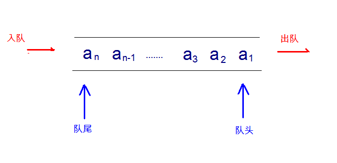

#### 数组

* **数组**:**Array**,是有序的元素序列，数组是在内存中开辟一段连续的空间，并在此空间存放元素。就像是一排出租屋，有100个房间，从001到100每个房间都有固定编号，通过编号就可以快速找到租房子的人。

简单的说,采用该结构的集合，对元素的存取有如下的特点：

* 查找元素快：通过索引，可以快速访问指定位置的元素

  

* 增删元素慢

  * **指定索引位置增加元素**：需要创建一个新数组，将指定新元素存储在指定索引位置，再把原数组元素根据索引，复制到新数组对应索引的位置。如下图
  
    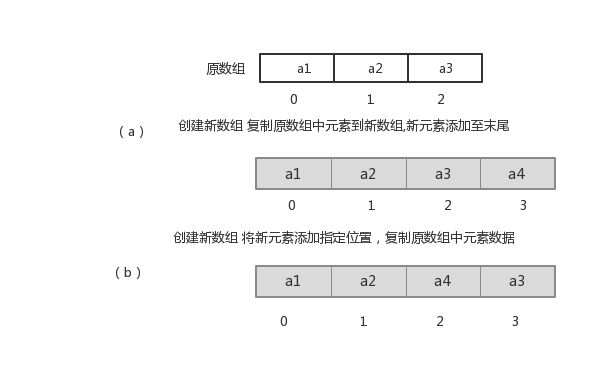
  
  * **指定索引位置删除元素：**需要创建一个新数组，把原数组元素根据索引，复制到新数组对应索引的位置，原数组中指定索引位置元素不复制到新数组中。如下图
  
    

####  链表

* **链表**:**linked list**,由一系列结点node（链表中每一个元素称为结点）组成，结点可以在运行时i动态生成。每个结点包括两个部分：一个是存储数据元素的数据域，另一个是存储下一个结点地址的指针域。我们常说的链表结构有单向链表与双向链表，那么这里给大家介绍的是**单向链表**。

  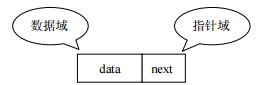

简单的说，采用该结构的集合，对元素的存取有如下的特点：

* 多个结点之间，通过地址进行连接。例如，多个人手拉手，每个人使用自己的右手拉住下个人的左手，依次类推，这样多个人就连在一起了。

  

* 查找元素慢：想查找某个元素，需要通过连接的节点，依次向后查找指定元素

* 增删元素快：

  * 增加元素：只需要修改连接下个元素的地址即可。

    

  * 删除元素：只需要修改连接下个元素的地址即可。

    

#### 红黑树

* **二叉树**：**binary tree** ,是每个结点不超过2的有序**树（tree）** 。

简单的理解，就是一种类似于我们生活中树的结构，只不过每个结点上都最多只能有两个子结点。

二叉树是每个节点最多有两个子树的树结构。顶上的叫根结点，两边被称作“左子树”和“右子树”。

如图：


我们要说的是二叉树的一种比较有意思的叫做**红黑树**，红黑树本身就是一颗二叉查找树，将节点插入后，该树仍然是一颗二叉查找树。也就意味着，树的键值仍然是有序的。

红黑树的约束:

1. 节点可以是红色的或者黑色的


2. 根节点是黑色的


3. 叶子节点(特指空节点)是黑色的
4. 每个红色节点的子节点都是黑色的
5. 任何一个节点到其每一个叶子节点的所有路径上黑色节点数相同

红黑树的特点:

​	速度特别快,趋近平衡树,查找叶子元素最少和最多次数不多于二倍

**jdk1.8之后，当链表长度超过8时会自动转换成红黑树， 为了提高查询速度**

## 第二章 List集合

我们掌握了Collection接口的使用后，再来看看Collection接口中的子类，他们都具备那些特性呢？

接下来，我们一起学习Collection中的常用几个子类（`java.util.List`集合、`java.util.Set`集合）。

### 1.1 List接口介绍

`java.util.List`接口继承自`Collection`接口，是单列集合的一个重要分支，习惯性地会将实现了`List`接口的对象称为List集合。在List集合中允许出现重复的元素，所有的元素是以一种线性方式进行存储的，在程序中可以通过索引来访问集合中的指定元素。另外，List集合还有一个特点就是元素有序，即元素的存入顺序和取出顺序一致。

看完API，我们总结一下：

List接口特点：

1. 它是一个元素存取有序的集合。例如，存元素的顺序是11、22、33。那么集合中，元素的存储就是按照11、22、33的顺序完成的）。
2. 它是一个带有索引的集合，通过索引就可以精确的操作集合中的元素（与数组的索引是一个道理）。
3. 集合中可以有重复的元素，通过元素的equals方法，来比较是否为重复的元素。

> tips:我们在基础班的时候已经学习过List接口的子类java.util.ArrayList类，该类中的方法都是来自List中定义。

### 1.2 List接口中常用方法3

List作为Collection集合的子接口，不但继承了Collection接口中的全部方法，而且还增加了一些根据元素索引来操作集合的特有方法，如下：

- `public void add(int index, E element)`: 将指定的元素，添加到该集合中的指定位置上。
- `public E get(int index)`:返回集合中指定位置的元素。
- `public E remove(int index)`: 移除列表中指定位置的元素, 返回的是被移除的元素。
- `public E set(int index, E element)`:用指定元素替换集合中指定位置的元素,返回值的更新前的元素。

List集合特有的方法都是跟索引相关，我们在基础班都学习过，那么我们再来复习一遍吧：

```java
public class ListDemo {
    public static void main(String[] args) {
		// 创建List集合对象
    	List<String> list = new ArrayList<String>();
    	
    	// 往 尾部添加 指定元素
    	list.add("图图");
    	list.add("小美");
    	list.add("不高兴");
    	
    	System.out.println(list);
    	// add(int index,String s) 往指定位置添加
    	list.add(1,"没头脑");
    	
    	System.out.println(list);
    	// String remove(int index) 删除指定位置元素  返回被删除元素
    	// 删除索引位置为2的元素 
    	System.out.println("删除索引位置为2的元素");
    	System.out.println(list.remove(2));
    	
    	System.out.println(list);
    	
    	// String set(int index,String s)
    	// 在指定位置 进行 元素替代（改） 
    	// 修改指定位置元素
    	list.set(0, "三毛");
    	System.out.println(list);
    	
    	// String get(int index)  获取指定位置元素
    	
    	// 跟size() 方法一起用  来 遍历的 
    	for(int i = 0;i<list.size();i++){
    		System.out.println(list.get(i));
    	}
    	//还可以使用增强for
    	for (String string : list) {
			System.out.println(string);
		}  	
	}
}
```

## 第三章 List的子类

### 3.1 ArrayList集合

`java.util.ArrayList`集合数据存储的结构是数组结构。元素增删慢，查找快，由于日常开发中使用最多的功能为查询数据、遍历数据，所以`ArrayList`是最常用的集合。

许多程序员开发时非常随意地使用ArrayList完成任何需求，并不严谨，这种用法是不提倡的。

### 3.2 LinkedList集合

`java.util.LinkedList`集合数据存储的结构是链表结构。方便元素添加、删除的集合。

> LinkedList是一个双向链表，那么双向链表是什么样子的呢，我们用个图了解下


实际开发中对一个集合元素的添加与删除经常涉及到首尾操作，而LinkedList提供了大量首尾操作的方法。这些方法我们作为了解即可：

* `public void addFirst(E e)`:将指定元素插入此列表的开头。
* `public void addLast(E e)`:将指定元素添加到此列表的结尾。
* `public E getFirst()`:返回此列表的第一个元素。
* `public E getLast()`:返回此列表的最后一个元素。
* `public E removeFirst()`:移除并返回此列表的第一个元素。
* `public E removeLast()`:移除并返回此列表的最后一个元素。
* `public E pop()`:从此列表所表示的堆栈处弹出一个元素。
* `public void push(E e)`:将元素推入此列表所表示的堆栈。
* `public boolean isEmpty()`：如果列表不包含元素，则返回true。

LinkedList是List的子类，List中的方法LinkedList都是可以使用，这里就不做详细介绍，我们只需要了解LinkedList的特有方法即可。在开发时，LinkedList集合也可以作为堆栈，队列的结构使用。（了解即可）

方法演示：

~~~java
public class LinkedListDemo {
    public static void main(String[] args) {
        LinkedList<String> link = new LinkedList<String>();
        //添加元素
        link.addFirst("abc1");
        link.addFirst("abc2");
        link.addFirst("abc3");
        System.out.println(link);
        // 获取元素
        System.out.println(link.getFirst());
        System.out.println(link.getLast());
        // 删除元素
        System.out.println(link.removeFirst());
        System.out.println(link.removeLast());

        while (!link.isEmpty()) { //判断集合是否为空
            System.out.println(link.pop()); //弹出集合中的栈顶元素
        }

        System.out.println(link);
    }
}
~~~

## 第四章 Set接口

`java.util.Set`接口和`java.util.List`接口一样，同样继承自`Collection`接口，它与`Collection`接口中的方法基本一致，并没有对`Collection`接口进行功能上的扩充，只是比`Collection`接口更加严格了。与`List`接口不同的是，`Set`接口中元素无序，并且都会以某种规则保证存入的元素不出现重复。

`Set`集合有多个子类，这里我们介绍其中的`java.util.HashSet`、`java.util.LinkedHashSet`这两个集合。

> tips:Set集合取出元素的方式可以采用：迭代器、增强for。

### 3.1 HashSet集合介绍

`java.util.HashSet`是`Set`接口的一个实现类，它所存储的元素是不可重复的，并且元素都是无序的(即存取顺序不一致)。`java.util.HashSet`底层的实现其实是一个`java.util.HashMap`支持，由于我们暂时还未学习，先做了解。

`HashSet`是根据对象的哈希值来确定元素在集合中的存储位置，因此具有良好的存取和查找性能。保证元素唯一性的方式依赖于：`hashCode`与`equals`方法。

我们先来使用一下Set集合存储，看下现象，再进行原理的讲解:

~~~java
public class HashSetDemo {
    public static void main(String[] args) {
        //创建 Set集合
        HashSet<String>  set = new HashSet<String>();

        //添加元素
        set.add(new String("cba"));
        set.add("abc");
        set.add("bac"); 
        set.add("cba");  
        //遍历
        for (String name : set) {
            System.out.println(name);
        }
    }
}
~~~

输出结果如下，说明集合中不能存储重复元素：

~~~
cba
abc
bac
~~~

> tips:根据结果我们发现字符串"cba"只存储了一个，也就是说重复的元素set集合不存储。

### 2.2  HashSet集合存储数据的结构（哈希表）

什么是哈希表呢？

在**JDK1.8**之前，哈希表底层采用数组+链表实现，即使用链表处理冲突，同一hash值的链表都存储在一个链表里。但是当位于一个桶中的元素较多，即hash值相等的元素较多时，通过key值依次查找的效率较低。而JDK1.8中，哈希表存储采用数组+链表+红黑树实现，当链表长度超过阈值（8）时，将链表转换为红黑树，这样大大减少了查找时间。

简单的来说，哈希表是由数组+链表+红黑树（JDK1.8增加了红黑树部分）实现的，如下图所示。


看到这张图就有人要问了，这个是怎么存储的呢？

为了方便大家的理解我们结合一个存储流程图来说明一下：


总而言之，**JDK1.8**引入红黑树大程度优化了HashMap的性能，那么对于我们来讲保证HashSet集合元素的唯一，其实就是根据对象的hashCode和equals方法来决定的。如果我们往集合中存放自定义的对象，那么保证其唯一，就必须复写hashCode和equals方法建立属于当前对象的比较方式。

### 2.3  HashSet存储自定义类型元素

给HashSet中存放自定义类型元素时，需要重写对象中的hashCode和equals方法，建立自己的比较方式，才能保证HashSet集合中的对象唯一

创建自定义Student类

~~~java
public class Student {
    private String name;
    private int age;

    public Student() {
    }

    public Student(String name, int age) {
        this.name = name;
        this.age = age;
    }

    public String getName() {
        return name;
    }

    public void setName(String name) {
        this.name = name;
    }

    public int getAge() {
        return age;
    }

    public void setAge(int age) {
        this.age = age;
    }

    @Override
    public boolean equals(Object o) {
        if (this == o)
            return true;
        if (o == null || getClass() != o.getClass())
            return false;
        Student student = (Student) o;
        return age == student.age &&
               Objects.equals(name, student.name);
    }

    @Override
    public int hashCode() {
        return Objects.hash(name, age);
    }
}
~~~

~~~java
public class HashSetDemo2 {
    public static void main(String[] args) {
        //创建集合对象   该集合中存储 Student类型对象
        HashSet<Student> stuSet = new HashSet<Student>();
        //存储 
        Student stu = new Student("于谦", 43);
        stuSet.add(stu);
        stuSet.add(new Student("郭德纲", 44));
        stuSet.add(new Student("于谦", 43));
        stuSet.add(new Student("郭麒麟", 23));
        stuSet.add(stu);

        for (Student stu2 : stuSet) {
            System.out.println(stu2);
        }
    }
}
执行结果：
Student [name=郭德纲, age=44]
Student [name=于谦, age=43]
Student [name=郭麒麟, age=23]
~~~

### 2.3 LinkedHashSet

我们知道HashSet保证元素唯一，可是元素存放进去是没有顺序的，那么我们要保证有序，怎么办呢？

在HashSet下面有一个子类`java.util.LinkedHashSet`，它是链表和哈希表组合的一个数据存储结构。

演示代码如下:

~~~java
public class LinkedHashSetDemo {
	public static void main(String[] args) {
		Set<String> set = new LinkedHashSet<String>();
		set.add("bbb");
		set.add("aaa");
		set.add("abc");
		set.add("bbc");
        Iterator<String> it = set.iterator();
		while (it.hasNext()) {
			System.out.println(it.next());
		}
	}
}
结果：
  bbb
  aaa
  abc
  bbc
~~~

### 1.9  可变参数

在**JDK1.5**之后，如果我们定义一个方法需要接受多个参数，并且多个参数类型一致，我们可以对其简化成如下格式：

```
修饰符 返回值类型 方法名(参数类型... 形参名){  }
```

其实这个书写完全等价与

```
修饰符 返回值类型 方法名(参数类型[] 形参名){  }
```

只是后面这种定义，在调用时必须传递数组，而前者可以直接传递数据即可。

**JDK1.5**以后。出现了简化操作。**...** 用在参数上，称之为可变参数。

同样是代表数组，但是在调用这个带有可变参数的方法时，不用创建数组(这就是简单之处)，直接将数组中的元素作为实际参数进行传递，其实编译成的class文件，将这些元素先封装到一个数组中，在进行传递。这些动作都在编译.class文件时，自动完成了。

代码演示：    

```java
public class ChangeArgs {
    public static void main(String[] args) {
        int[] arr = { 1, 4, 62, 431, 2 };
        int sum = getSum(arr);
        System.out.println(sum);
        //  6  7  2 12 2121
        // 求 这几个元素和 6  7  2 12 2121
        int sum2 = getSum(6, 7, 2, 12, 2121);
        System.out.println(sum2);
    }

    /*
     * 完成数组  所有元素的求和 原始写法
     
      public static int getSum(int[] arr){
        int sum = 0;
        for(int a : arr){
            sum += a;
        }
        
        return sum;
      }
    */
    //可变参数写法
    public static int getSum(int... arr) {
        int sum = 0;
        for (int a : arr) {
            sum += a;
        }
        return sum;
    }
}
```

> tips: 上述add方法在同一个类中，只能存在一个。因为会发生调用的不确定性
>
> 注意：如果在方法书写时，这个方法拥有多参数，参数中包含可变参数，可变参数一定要写在参数列表的末尾位置。


## 第五章  Collections

### 2.1 常用功能

* `java.utils.Collections`是集合工具类，用来对集合进行操作。部分方法如下：

- `public static <T> boolean addAll(Collection<T> c, T... elements)  `:往集合中添加一些元素。
- `public static void shuffle(List<?> list) 打乱顺序`:打乱集合顺序。
- `public static <T> void sort(List<T> list)`:将集合中元素按照默认规则排序。
- `public static <T> void sort(List<T> list，Comparator<? super T> )`:将集合中元素按照指定规则排序。

代码演示：

```java
public class CollectionsDemo {
    public static void main(String[] args) {
        ArrayList<Integer> list = new ArrayList<Integer>();
        //原来写法
        //list.add(12);
        //list.add(14);
        //list.add(15);
        //list.add(1000);
        //采用工具类 完成 往集合中添加元素  
        Collections.addAll(list, 5, 222, 1，2);
        System.out.println(list);
        //排序方法 
        Collections.sort(list);
        System.out.println(list);
    }
}
结果：
[5, 222, 1, 2]
[1, 2, 5, 222]
```

代码演示之后 ，发现我们的集合按照顺序进行了排列，可是这样的顺序是采用默认的顺序，如果想要指定顺序那该怎么办呢？

我们发现还有个方法没有讲，`public static <T> void sort(List<T> list，Comparator<? super T> )`:将集合中元素按照指定规则排序。接下来讲解一下指定规则的排列。

### 2.2 Comparator比较器

我们还是先研究这个方法

`public static <T> void sort(List<T> list)`:将集合中元素按照默认规则排序。

不过这次存储的是字符串类型。

```java
public class CollectionsDemo2 {
    public static void main(String[] args) {
        ArrayList<String>  list = new ArrayList<String>();
        list.add("cba");
        list.add("aba");
        list.add("sba");
        list.add("nba");
        //排序方法
        Collections.sort(list);
        System.out.println(list);
    }
}
```

结果：

```
[aba, cba, nba, sba]
```

我们使用的是默认的规则完成字符串的排序，那么默认规则是怎么定义出来的呢？

说到排序了，简单的说就是两个对象之间比较大小，那么在JAVA中提供了两种比较实现的方式，一种是比较死板的采用`java.lang.Comparable`接口去实现，一种是灵活的当我需要做排序的时候在去选择的`java.util.Comparator`接口完成。

那么我们采用的`public static <T> void sort(List<T> list)`这个方法完成的排序，实际上要求了被排序的类型需要实现Comparable接口完成比较的功能，在String类型上如下：

```java
public final class String implements java.io.Serializable, Comparable<String>, CharSequence {
```

String类实现了这个接口，并完成了比较规则的定义，但是这样就把这种规则写死了，那比如我想要字符串按照第一个字符降序排列，那么这样就要修改String的源代码，这是不可能的了，那么这个时候我们可以使用

`public static <T> void sort(List<T> list，Comparator<? super T> )`方法灵活的完成，这个里面就涉及到了Comparator这个接口，位于位于java.util包下，排序是comparator能实现的功能之一,该接口代表一个比较器，比较器具有可比性！顾名思义就是做排序的，通俗地讲需要比较两个对象谁排在前谁排在后，那么比较的方法就是：

* ` public int compare(String o1, String o2)`：比较其两个参数的顺序。

  > 两个对象比较的结果有三种：大于，等于，小于。
  >
  > 如果要按照升序排序，
  > 则o1 小于o2，返回（负数），相等返回0，01大于02返回（正数）
  > 如果要按照降序排序
  > 则o1 小于o2，返回（正数），相等返回0，01大于02返回（负数）

操作如下:

```java
public class CollectionsDemo3 {
    public static void main(String[] args) {
        ArrayList<String> list = new ArrayList<String>();
        list.add("cba");
        list.add("aba");
        list.add("sba");
        list.add("nba");
        //排序方法  按照第一个单词的降序
        Collections.sort(list, new Comparator<String>() {
            @Override
            public int compare(String o1, String o2) {
                return o2.charAt(0) - o1.charAt(0);
            }
        });
        System.out.println(list);
    }
}
```

结果如下：

```
[sba, nba, cba, aba]
```

### 2.3 简述Comparable和Comparator两个接口的区别。

**Comparable**：强行对实现它的每个类的对象进行整体排序。这种排序被称为类的自然排序，类的compareTo方法被称为它的自然比较方法。只能在类中实现compareTo()一次，不能经常修改类的代码实现自己想要的排序。实现此接口的对象列表（和数组）可以通过**Collections.sort**（和**Arrays.sort**）进行自动排序，对象可以用作有序映射中的键或有序集合中的元素，无需指定比较器。

**Comparator**强行对某个对象进行整体排序。可以将Comparator 传递给sort方法（如Collections.sort或 Arrays.sort），从而允许在排序顺序上实现精确控制。还可以使用Comparator来控制某些数据结构（如有序set或有序映射）的顺序，或者为那些没有自然顺序的对象collection提供排序。

### 2.4  练习

创建一个学生类，存储到ArrayList集合中完成指定排序操作。

Student 初始类

~~~java
public class Student{
    private String name;
    private int age;

    public Student() {
    }

    public Student(String name, int age) {
        this.name = name;
        this.age = age;
    }

    public String getName() {
        return name;
    }

    public void setName(String name) {
        this.name = name;
    }

    public int getAge() {
        return age;
    }

    public void setAge(int age) {
        this.age = age;
    }

    @Override
    public String toString() {
        return "Student{" +
               "name='" + name + '\'' +
               ", age=" + age +
               '}';
    }
}
~~~

测试类：

~~~java
public class Demo {

    public static void main(String[] args) {
        // 创建四个学生对象 存储到集合中
        ArrayList<Student> list = new ArrayList<Student>();

        list.add(new Student("rose",18));
        list.add(new Student("jack",16));
        list.add(new Student("abc",16));
        list.add(new Student("ace",17));
        list.add(new Student("mark",16));


        /*
          让学生 按照年龄排序 升序
         */
//        Collections.sort(list);//要求 该list中元素类型  必须实现比较器Comparable接口


        for (Student student : list) {
            System.out.println(student);
        }


    }
}
~~~

发现，当我们调用Collections.sort()方法的时候 程序报错了。

原因：如果想要集合中的元素完成排序，那么必须要实现比较器Comparable接口。

于是我们就完成了Student类的一个实现，如下：

~~~java
public class Student implements Comparable<Student>{
    ....
    @Override
    public int compareTo(Student o) {
        return this.age-o.age;//升序
    }
}
~~~

再次测试，代码就OK 了效果如下：

~~~java
Student{name='jack', age=16}
Student{name='abc', age=16}
Student{name='mark', age=16}
Student{name='ace', age=17}
Student{name='rose', age=18}
~~~

### 2.5 扩展

如果在使用的时候，想要独立的定义规则去使用 可以采用Collections.sort(List list,Comparetor<T> c)方式，自己定义规则：

~~~java
Collections.sort(list, new Comparator<Student>() {
    @Override
    public int compare(Student o1, Student o2) {
        return o2.getAge()-o1.getAge();//以学生的年龄降序
    }
});
~~~

效果：

~~~
Student{name='rose', age=18}
Student{name='ace', age=17}
Student{name='jack', age=16}
Student{name='abc', age=16}
Student{name='mark', age=16}
~~~

如果想要规则更多一些，可以参考下面代码：

~~~java
Collections.sort(list, new Comparator<Student>() {
            @Override
            public int compare(Student o1, Student o2) {
                // 年龄降序
                int result = o2.getAge()-o1.getAge();//年龄降序

                if(result==0){//第一个规则判断完了 下一个规则 姓名的首字母 升序
                    result = o1.getName().charAt(0)-o2.getName().charAt(0);
                }

                return result;
            }
        });
~~~

效果如下：

~~~
Student{name='rose', age=18}
Student{name='ace', age=17}
Student{name='abc', age=16}
Student{name='jack', age=16}
Student{name='mark', age=16}
~~~

# Map

## 教学目标

- 能够说出Map集合特点
- 使用Map集合添加方法保存数据
- 使用”键找值”的方式遍历Map集合
- 使用”键值对”的方式遍历Map集合
- 能够使用HashMap存储自定义键值对的数据
- 能够使用HashMap编写斗地主洗牌发牌案例

## 第一章 Map集合

### 1.1 概述

现实生活中，我们常会看到这样的一种集合：IP地址与主机名，身份证号与个人，系统用户名与系统用户对象等，这种一一对应的关系，就叫做映射。Java提供了专门的集合类用来存放这种对象关系的对象，即`java.util.Map`接口。

我们通过查看`Map`接口描述，发现`Map`接口下的集合与`Collection`接口下的集合，它们存储数据的形式不同，如下图。


* `Collection`中的集合，元素是孤立存在的（理解为单身），向集合中存储元素采用一个个元素的方式存储。
* `Map`中的集合，元素是成对存在的(理解为夫妻)。每个元素由键与值两部分组成，通过键可以找对所对应的值。
* `Collection`中的集合称为单列集合，`Map`中的集合称为双列集合。
* 需要注意的是，`Map`中的集合不能包含重复的键，值可以重复；每个键只能对应一个值。

### 1.2  Map常用子类

通过查看Map接口描述，看到Map有多个子类，这里我们主要讲解常用的HashMap集合、LinkedHashMap集合。

* **HashMap<K,V>**：存储数据采用的哈希表结构，元素的存取顺序不能保证一致。由于要保证键的唯一、不重复，需要重写键的hashCode()方法、equals()方法。
* **LinkedHashMap<K,V>**：HashMap下有个子类LinkedHashMap，存储数据采用的哈希表结构+链表结构。通过链表结构可以保证元素的存取顺序一致；通过哈希表结构可以保证的键的唯一、不重复，需要重写键的hashCode()方法、equals()方法。

> tips：Map接口中的集合都有两个泛型变量<K,V>,在使用时，要为两个泛型变量赋予数据类型。两个泛型变量<K,V>的数据类型可以相同，也可以不同。

### 1.3  Map接口中的常用方法

Map接口中定义了很多方法，常用的如下：

* `public V put(K key, V value)`:  把指定的键与指定的值添加到Map集合中。
* `public V remove(Object key)`: 把指定的键 所对应的键值对元素 在Map集合中删除，返回被删除元素的值。
* `public V get(Object key)` 根据指定的键，在Map集合中获取对应的值。
* `boolean containsKey(Object key)  ` 判断集合中是否包含指定的键。
* `public Set<K> keySet()`: 获取Map集合中所有的键，存储到Set集合中。
* `public Set<Map.Entry<K,V>> entrySet()`: 获取到Map集合中所有的键值对对象的集合(Set集合)。

Map接口的方法演示

~~~java
public class MapDemo {
    public static void main(String[] args) {
        //创建 map对象
        HashMap<String, String>  map = new HashMap<String, String>();

        //添加元素到集合
        map.put("黄晓明", "杨颖");
        map.put("文章", "马伊琍");
        map.put("邓超", "孙俪");
        System.out.println(map);

        //String remove(String key)
        System.out.println(map.remove("邓超"));
        System.out.println(map);

        // 想要查看 黄晓明的媳妇 是谁
        System.out.println(map.get("黄晓明"));
        System.out.println(map.get("邓超"));    
    }
}
~~~

> tips:
>
> 使用put方法时，若指定的键(key)在集合中没有，则没有这个键对应的值，返回null，并把指定的键值添加到集合中； 
>
> 若指定的键(key)在集合中存在，则返回值为集合中键对应的值（该值为替换前的值），并把指定键所对应的值，替换成指定的新值。 

### 1.4   Map集合遍历键找值方式

键找值方式：即通过元素中的键，获取键所对应的值

分析步骤：

1. 获取Map中所有的键，由于键是唯一的，所以返回一个Set集合存储所有的键。方法提示:`keyset()`
2. 遍历键的Set集合，得到每一个键。
3. 根据键，获取键所对应的值。方法提示:`get(K key)`

代码演示：

~~~java
public class MapDemo01 {
    public static void main(String[] args) {
        //创建Map集合对象 
        HashMap<String, String> map = new HashMap<String,String>();
        //添加元素到集合 
        map.put("胡歌", "霍建华");
        map.put("郭德纲", "于谦");
        map.put("薛之谦", "大张伟");

        //获取所有的键  获取键集
        Set<String> keys = map.keySet();
        // 遍历键集 得到 每一个键
        for (String key : keys) {
          	//key  就是键
            //获取对应值
            String value = map.get(key);
            System.out.println(key+"的CP是："+value);
        }  
    }
}
~~~

遍历图解：


### 1.5  Entry键值对对象

我们已经知道，`Map`中存放的是两种对象，一种称为**key**(键)，一种称为**value**(值)，它们在在`Map`中是一一对应关系，这一对对象又称做`Map`中的一个`Entry(项)`。`Entry`将键值对的对应关系封装成了对象。即键值对对象，这样我们在遍历`Map`集合时，就可以从每一个键值对（`Entry`）对象中获取对应的键与对应的值。

 既然Entry表示了一对键和值，那么也同样提供了获取对应键和对应值得方法：

* `public K getKey()`：获取Entry对象中的键。
* `public V getValue()`：获取Entry对象中的值。

在Map集合中也提供了获取所有Entry对象的方法：

* `public Set<Map.Entry<K,V>> entrySet()`: 获取到Map集合中所有的键值对对象的集合(Set集合)。

### 1.6 Map集合遍历键值对方式

键值对方式：即通过集合中每个键值对(Entry)对象，获取键值对(Entry)对象中的键与值。

操作步骤与图解：

1.  获取Map集合中，所有的键值对(Entry)对象，以Set集合形式返回。方法提示:`entrySet()`。

2.  遍历包含键值对(Entry)对象的Set集合，得到每一个键值对(Entry)对象。
3.  通过键值对(Entry)对象，获取Entry对象中的键与值。  方法提示:`getkey() getValue()`     

~~~java
public class MapDemo02 {
    public static void main(String[] args) {
        // 创建Map集合对象 
        HashMap<String, String> map = new HashMap<String,String>();
        // 添加元素到集合 
        map.put("胡歌", "霍建华");
        map.put("郭德纲", "于谦");
        map.put("薛之谦", "大张伟");

        // 获取 所有的 entry对象  entrySet
        Set<Entry<String,String>> entrySet = map.entrySet();

        // 遍历得到每一个entry对象
        for (Entry<String, String> entry : entrySet) {
           	// 解析 
            String key = entry.getKey();
            String value = entry.getValue();  
            System.out.println(key+"的CP是:"+value);
        }
    }
}
~~~

遍历图解：


> tips：Map集合不能直接使用迭代器或者foreach进行遍历。但是转成Set之后就可以使用了。

### 1.7  HashMap存储自定义类型键值

练习：每位学生（姓名，年龄）都有自己的家庭住址。那么，既然有对应关系，则将学生对象和家庭住址存储到map集合中。学生作为键, 家庭住址作为值。

> 注意，学生姓名相同并且年龄相同视为同一名学生。

编写学生类：

~~~java
public class Student {
    private String name;
    private int age;

    public Student() {
    }

    public Student(String name, int age) {
        this.name = name;
        this.age = age;
    }

    public String getName() {
        return name;
    }

    public void setName(String name) {
        this.name = name;
    }

    public int getAge() {
        return age;
    }

    public void setAge(int age) {
        this.age = age;
    }

    @Override
    public boolean equals(Object o) {
        if (this == o)
            return true;
        if (o == null || getClass() != o.getClass())
            return false;
        Student student = (Student) o;
        return age == student.age && Objects.equals(name, student.name);
    }

    @Override
    public int hashCode() {
        return Objects.hash(name, age);
    }
}
~~~

编写测试类：

~~~java 
public class HashMapTest {
    public static void main(String[] args) {
        //1,创建Hashmap集合对象。
        Map<Student,String>map = new HashMap<Student,String>();
        //2,添加元素。
        map.put(newStudent("lisi",28), "上海");
        map.put(newStudent("wangwu",22), "北京");
        map.put(newStudent("zhaoliu",24), "成都");
        map.put(newStudent("zhouqi",25), "广州");
        map.put(newStudent("wangwu",22), "南京");
        
        //3,取出元素。键找值方式
        Set<Student>keySet = map.keySet();
        for(Student key: keySet){
            Stringvalue = map.get(key);
            System.out.println(key.toString()+"....."+value);
        }
    }
}
~~~

* 当给HashMap中存放自定义对象时，如果自定义对象作为key存在，这时要保证对象唯一，必须复写对象的hashCode和equals方法(如果忘记，请回顾HashSet存放自定义对象)。
* 如果要保证map中存放的key和取出的顺序一致，可以使用`java.util.LinkedHashMap`集合来存放。

### 1.8   LinkedHashMap

我们知道HashMap保证成对元素唯一，并且查询速度很快，可是成对元素存放进去是没有顺序的，那么我们要保证有序，还要速度快怎么办呢？

在HashMap下面有一个子类LinkedHashMap，它是链表和哈希表组合的一个数据存储结构。

~~~java
public class LinkedHashMapDemo {
    public static void main(String[] args) {
        LinkedHashMap<String, String> map = new LinkedHashMap<String, String>();
        map.put("邓超", "孙俪");
        map.put("李晨", "范冰冰");
        map.put("刘德华", "朱丽倩");
        Set<Entry<String, String>> entrySet = map.entrySet();
        for (Entry<String, String> entry : entrySet) {
            System.out.println(entry.getKey() + "  " + entry.getValue());
        }
    }
}
~~~

结果:

~~~
邓超  孙俪
李晨  范冰冰
刘德华  朱丽倩
~~~

### 1.9 Map集合练习

**需求：**

计算一个字符串中每个字符出现次数。

**分析：**

1.  获取一个字符串对象
2.  创建一个Map集合，键代表字符，值代表次数。
3.  遍历字符串得到每个字符。
4.  判断Map中是否有该键。
5.  如果没有，第一次出现，存储次数为1；如果有，则说明已经出现过，获取到对应的值进行++，再次存储。     
6.  打印最终结果

**代码：**

~~~java
public class MapTest {
public static void main(String[] args) {
        //友情提示
        System.out.println("请录入一个字符串:");
        String line = new Scanner(System.in).nextLine();
        // 定义 每个字符出现次数的方法
        findChar(line);
    }
    private static void findChar(String line) {
        //1:创建一个集合 存储  字符 以及其出现的次数
        HashMap<Character, Integer> map = new HashMap<Character, Integer>();
        //2:遍历字符串
        for (int i = 0; i < line.length(); i++) {
            char c = line.charAt(i);
            //判断 该字符 是否在键集中
            if (!map.containsKey(c)) {//说明这个字符没有出现过
                //那就是第一次
                map.put(c, 1);
            } else {
                //先获取之前的次数
                Integer count = map.get(c);
                //count++;
                //再次存入  更新
                map.put(c, ++count);
            }
        }
        System.out.println(map);
    }
}
~~~

## 第二章 补充知识点

### 2.1  JDK9对集合添加的优化

通常，我们在代码中创建一个集合（例如，List 或 Set ），并直接用一些元素填充它。 实例化集合，几个 add方法 调用，使得代码重复。

~~~java
public class Demo01 {
    public static void main(String[] args) {
        List<String> list = new ArrayList<>();
        list.add("abc");
        list.add("def");
        list.add("ghi");
        System.out.println(list);
    }
}
~~~

 Java 9，添加了几种集合工厂方法,更方便创建少量元素的集合、map实例。新的List、Set、Map的静态工厂方法可以更方便地创建集合的不可变实例。

例子：

~~~java
public class HelloJDK9 {  
    public static void main(String[] args) {  
        Set<String> str1=Set.of("a","b","c");  
        //str1.add("c");这里编译的时候不会错，但是执行的时候会报错，因为是不可变的集合  
        System.out.println(str1);  
        Map<String,Integer> str2=Map.of("a",1,"b",2);  
        System.out.println(str2);  
        List<String> str3=List.of("a","b");  
        System.out.println(str3);  
    }  
} 
~~~

需要注意以下两点：

> 1:of()方法只是Map，List，Set这三个接口的静态方法，其父类接口和子类实现并没有这类方法，比如    HashSet，ArrayList等待；
>
> 2:返回的集合是不可变的；

### 2.2 Debug追踪

**使用IDEA的断点调试功能，查看程序的运行过程**

1. 在有效代码行，点击行号右边的空白区域，设置断点，程序执行到断点将停止，我们可以手动来运行程序 	

   

2. 点击Debug运行模式    

                                                                                                                                                            

3. 程序停止在断点上不再执行，而IDEA最下方打开了Debug调试窗口  

    

    

4. Debug调试窗口介绍

   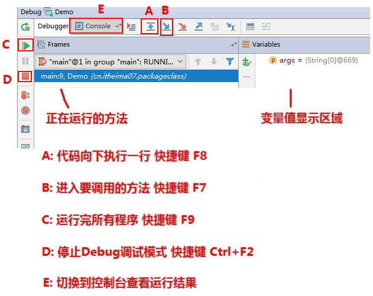

5. 快捷键F8，代码向下执行一行,第九行执行完毕，执行到第10行（第10行还未执行）

   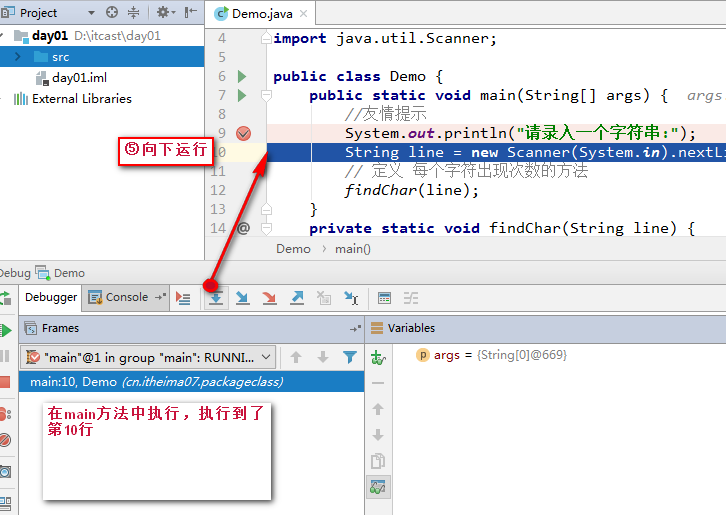

6. 切换到控制台面板，控制台显示 请录入一个字符串： 并且等待键盘录入

   

7. 快捷键F8，程序继续向后执行，执行键盘录入操作，在控制台录入数据 ababcea

   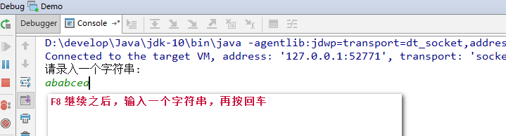

   回车之后效果：

   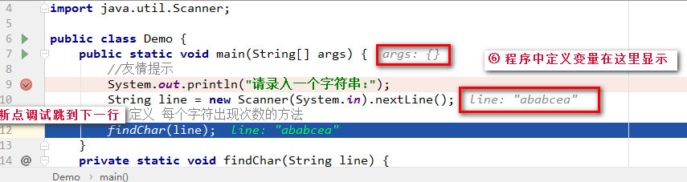

   调试界面效果：

   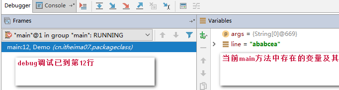

8. 此时到达findChar方法，快捷键F7，进入方法findChar

   

9. 快捷键F8 接续执行，创建了map对象，变量区域显示

   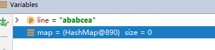

10. 快捷键F8 接续执行，进入到循环中，循环变量i为 0,F8再继续执行，就获取到变量c赋值为字符‘a’ 字节值97

    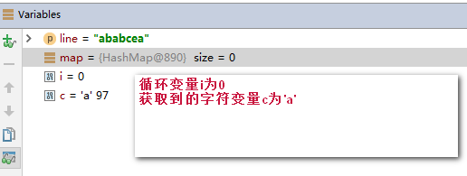

11. 快捷键F8 接续执行，进入到判断语句中，因为该字符 不在Map集合键集中，再按F8执行，进入该判断中

     

12. 快捷键F8 接续执行，循环结束，进入下次循环，此时map中已经添加一对儿元素

     

13. 快捷键F8 接续执行，进入下次循环，再继续上面的操作，我们就可以看到代码每次是如何执行的了

     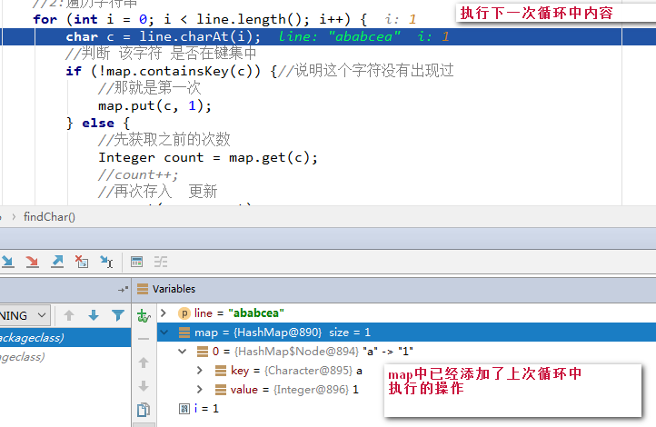

14. 如果不想继续debug,那么可以使用快捷键F9,程序正常执行到结束，程序结果在控制台显示

     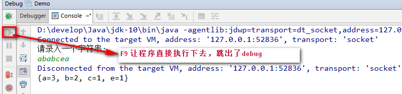

## 第三章  模拟斗地主洗牌发牌

### 3.1 案例介绍

按照斗地主的规则，完成洗牌发牌的动作。

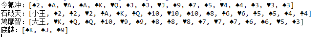

具体规则：

1. 组装54张扑克牌将
2. 54张牌顺序打乱
3. 三个玩家参与游戏，三人交替摸牌，每人17张牌，最后三张留作底牌。
4. 查看三人各自手中的牌（按照牌的大小排序）、底牌

> 规则：手中扑克牌从大到小的摆放顺序：大王,小王,2,A,K,Q,J,10,9,8,7,6,5,4,3

### 3.2 案例需求分析

1.  准备牌：


完成数字与纸牌的映射关系：

使用双列Map(HashMap)集合，完成一个数字与字符串纸牌的对应关系(相当于一个字典)。

2.  洗牌：

通过数字完成洗牌发牌

3.  发牌：

将每个人以及底牌设计为ArrayList<String>,将最后3张牌直接存放于底牌，剩余牌通过对3取模依次发牌。

存放的过程中要求数字大小与斗地主规则的大小对应。

将代表不同纸牌的数字分配给不同的玩家与底牌。

4.  看牌：

通过Map集合找到对应字符展示。

通过查询纸牌与数字的对应关系，由数字转成纸牌字符串再进行展示。


### 3.3  实现代码步骤

~~~java
public class Poker {
    public static void main(String[] args) {
        /*
         * 1组装54张扑克牌
         */
        // 1.1 创建Map集合存储
        HashMap<Integer, String> pokerMap = new HashMap<Integer, String>();
        // 1.2 创建 花色集合 与 数字集合
        ArrayList<String> colors = new ArrayList<String>();
        ArrayList<String> numbers = new ArrayList<String>();

        // 1.3 存储 花色 与数字
        Collections.addAll(colors, "♦", "♣", "♥", "♠");
        Collections.addAll(numbers, "2", "A", "K", "Q", "J", "10", "9", "8", "7", "6", "5", "4", "3");
        // 设置 存储编号变量
        int count = 1;
        pokerMap.put(count++, "大王");
        pokerMap.put(count++, "小王");
        // 1.4 创建牌 存储到map集合中
        for (String number : numbers) {
            for (String color : colors) {
                String card = color + number;
                pokerMap.put(count++, card);
            }
        }
        /*
         * 2 将54张牌顺序打乱
         */
        // 取出编号 集合
        Set<Integer> numberSet = pokerMap.keySet();
        // 因为要将编号打乱顺序 所以 应该先进行转换到 list集合中
        ArrayList<Integer> numberList = new ArrayList<Integer>();
        numberList.addAll(numberSet);

        // 打乱顺序
        Collections.shuffle(numberList);

        // 3 完成三个玩家交替摸牌，每人17张牌，最后三张留作底牌
        // 3.1 发牌的编号
        // 创建三个玩家编号集合 和一个 底牌编号集合
        ArrayList<Integer> noP1 = new ArrayList<Integer>();
        ArrayList<Integer> noP2 = new ArrayList<Integer>();
        ArrayList<Integer> noP3 = new ArrayList<Integer>();
        ArrayList<Integer> dipaiNo = new ArrayList<Integer>();

        // 3.2发牌的编号
        for (int i = 0; i < numberList.size(); i++) {
            // 获取该编号
            Integer no = numberList.get(i);
            // 发牌
            // 留出底牌
            if (i >= 51) {
                dipaiNo.add(no);
            } else {
                if (i % 3 == 0) {
                    noP1.add(no);
                } else if (i % 3 == 1) {
                    noP2.add(no);
                } else {
                    noP3.add(no);
                }
            }
        }

        // 4 查看三人各自手中的牌（按照牌的大小排序）、底牌
        // 4.1 对手中编号进行排序
        Collections.sort(noP1);
        Collections.sort(noP2);
        Collections.sort(noP3);
        Collections.sort(dipaiNo);

        // 4.2 进行牌面的转换
        // 创建三个玩家牌面集合 以及底牌牌面集合
        ArrayList<String> player1 = new ArrayList<String>();
        ArrayList<String> player2 = new ArrayList<String>();
        ArrayList<String> player3 = new ArrayList<String>();
        ArrayList<String> dipai = new ArrayList<String>();

        // 4.3转换
        for (Integer i : noP1) {
            // 4.4 根据编号找到 牌面 pokerMap
            String card = pokerMap.get(i);
            // 添加到对应的 牌面集合中
            player1.add(card);
        }

        for (Integer i : noP2) {
            String card = pokerMap.get(i);
            player2.add(card);
        }
        for (Integer i : noP3) {
            String card = pokerMap.get(i);
            player3.add(card);
        }
        for (Integer i : dipaiNo) {
            String card = pokerMap.get(i);
            dipai.add(card);
        }

        //4.5 查看
        System.out.println("令狐冲："+player1);
        System.out.println("石破天："+player2);
        System.out.println("鸠摩智："+player3);
        System.out.println("底牌："+dipai);
    }
}
~~~

 
